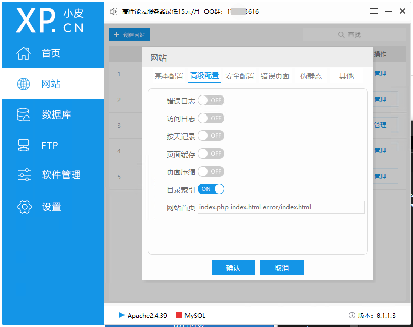

# 目录索引

::: tip 注意事项
- 安全性：启用目录索引可能会暴露服务器上的文件结构，建议仅在必要时启用，并确保敏感文件不被公开访问。
- 自定义样式：可以通过创建 .htaccess 文件来自定义目录索引的样式和行为。
:::

## 在小皮面板中打开


## 或是在配置文件中设置
```php
# httpd.conf
# 假设你有一个目录 /var/www/html/docs
<Directory "/var/www/html/docs">
    Options Indexes FollowSymLinks
    AllowOverride None
    Require all granted
</Directory>
```
重启Apache服务后，访问 http://your-server/docs 即可看到该目录下的文件列表。


::: tip 提示
- 二选一即可
:::