# Cisco Firepower 1010
---


::: info 2025年7月27日
:::

::: info 本教程目的
- 重新映像 `Cisco Firepower 1010` FTD
- `Cisco Firepower 1010` 威胁防御的透明防火墙模式
- 使用管理中心部署威胁防御 (本地管理网络上的管理中心)
:::

::: info 本教程需求
- Linux 基础知识
- Cisco 基础知识
- 电脑
- 网线 × 3
- Console线
- 路由器 (网口 >= 3)
- Cisco Firepower 1010 硬件
- Cisco Firepower 1010 软件
<br>
安装包 : `cisco-ftd-fp1k.7.4.2-172.SPA`

- Minicom (串口终端软件)
- atftpd (tftp服务器)

可能需要
- 电脑 × 3 (Linux × 1 + 任意系统 × 2)
- usb网卡 × 2 (电脑网口不足时使用)
- usb拓展坞
:::

::: tip 在开始之前应该查看以下官方内容
- [Cisco Firepower 1000 系列防火墙](https://www.cisco.com/site/cn/zh/products/security/firewalls/firepower-1000-series/index.html)
- [Cisco Firepower 1010 系列硬件安装指南](https://www.cisco.com/c/zh_cn/td/docs/security/firepower/1010/hw/guide/hw-install-1010/overview.html)
- [重新映像1000、2100和3100系列的安全FTD](https://www.cisco.com/c/zh_cn/support/docs/security/firepower-1000-series/220642-reimage-a-secure-firewall-threat-defense.html)
- [《Cisco Firepower 1010 入门指南》/ Chapter: 使用管理中心部署威胁防御 _en-us](https://www.cisco.com/c/en/us/td/docs/security/firepower/quick_start/fp1010/fmc-local/cfp-1010-ftd-get-start_fmc-local/m_cable-and-register-the-firewall.html)

::: details FMC / FTD 软件下载
- [官网下载](https://software.cisco.com/download/)
```c
FMC
|   Downloads Home
|   Security
|   Firewalls
|   Firewall Management
|   Secure Firewall Management Center Virtual
└─  Firepower Management Center Software

FTD
|   Downloads Home
|   Security
|   Firewalls
|   Next-Generation Firewalls (NGFW)
|   Firepower 1000 Series
|   Firepower 1010 Security Appliance
└─  Firepower Threat Defense (FTD) Software
```
:::

::: tip 提示
- 部分官方中文教程并不是最新版
- 不同语言的官方教程有出处
- 查看官方教程时应该在 熟悉的语言教程 和 英语教程 中切换对比
:::


## 管理电脑(Linux) 开启tftp服务器
### 查看配置文件
- 管理电脑/
- 查看 atftpd 配置文件 确定目录位置
```bash
less -N /etc/default/atftpd
```
```log
      1 ## Options for atftpd:
      2 OPTIONS="--port 69 --tftpd-timeout 300 --retry-timeout 5 --mcast-port 1758 --mcast-addr 23      2 9.239.239.0-255 --mcast-ttl 1 --maxthread 100 --verbose=5 /srv/tftp"
/etc/default/atftpd (END)
```

### 上传文件
- 管理电脑/
- 移动 安装包().SPA 到目录
```bash
sudo mv ./cisco-ftd-fp1k.7.4.2-172.SPA /srv/tftp/
```

### 启动 atftpd
- 管理电脑/
- 启动 atftpd
```bash
sudo systemctl start atftpd
```

- 管理电脑/
- 查看 atftpd 状态
```bash
sudo systemctl status atftpd
```
```log
● atftpd.service - Advanced TFTP Server
     Loaded: loaded (/usr/lib/systemd/system/atftpd.service; indirect; preset: disabled)
     Active: active (running) since Sun 2025-07-27 04:36:20 CST; 6s ago
 Invocation: a66abe721d7a4516b0986af17e343daf
TriggeredBy: ● atftpd.socket
       Docs: man:in.tftpd
   Main PID: 2473749 (in.tftpd)
      Tasks: 1 (limit: 18967)
     Memory: 328K (peak: 1.8M)
        CPU: 10ms
     CGroup: /system.slice/atftpd.service
             └─2473749 /usr/sbin/in.tftpd --port 69 --tftpd-timeout 300 --retry-timeout 5 --mcast>
```

- 管理电脑/
- 停止 atftpd
```bash
sudo systemctl stop atftpd
```
```log
Stopping 'atftpd.service', but its triggering units are still active:
atftpd.socket
```
```bash
sudo systemctl stop atftpd.socket
```

### 确认 tftp 服务器是否有效
- 管理电脑/
```bash
tftp localhost
```

- 管理电脑/tftp/
- 下载文件
```bash
get file
```

- 管理电脑/tftp/
- 上传文件
```bash
put file
```


## 接口说明
以下图示显示了 Firepower 1010 和 1010E 的后面板


|   |   |   |   |
|-|-|-|-|
| 1 | Status LEDs <br> 状态指示灯 | 2 | Management port <br> 管理端口 |
| 3 | Lock slot <br> 锁定插槽 | 4 | Power cord socket <br> 电源线插孔 |
| 5 | Network data ports <br> 网络数据端口 | 6 | Console port <br> Console 端口 |
| 7 | USB Mini B port <br> USB Mini B 端口 | 8 | USB Type A port <br> USB Type A 端口 |
| 9 | Reset button <br> 复位按钮 | 10 | Rubber feet <br> 橡胶脚 |

::: tip 提示
Console线 应该连接到 ⑥ 或 ⑦
:::


## 连接管理电脑 (Linux)


### 通过命令查看连接情况
- 管理电脑/
```bash
dmesg | grep tty
```
```bash
lsusb
```
::: tip 提示
有时usb网卡会误识别成其他设备
:::

### 启动串口终端软件
- 管理电脑/
```bash
minicom --wrap --color on --baudrate 9600 --device /dev/ttyUSB0 --capturefile firepower.out
```
```log

欢迎使用 minicom 2.9

选项: I18n
通信端口 /dev/ttyUSB0

按 CTRL-A Z 说明特殊键


CTRL-A Z for help | 9600 8N1 | NOR | Minicom 2.9 | VT102 | 脱机 | ttyUSB0
```
::: info 命令参数说明
- --wrap        -启用自动换行
- --color       -启用 或 禁用 ANSI 样式颜色
- --baudrate    -设置波特率
- --device      -设置设备名称
- --capturefile -开始捕获输出到 FILE 文件 (死亡回放)
:::


## 通电 开机！
::: tip 提示
- 因为没有电源开关，所以通电将自动开机
- 首次开机或是重置，需要等待30到40分钟
- 启动时， Minicom 将会看到输出
- 启动完成后即可 登录FXOS机箱CLI
:::


## 重新映像1000、2100和3100系列的安全FTD
::: tip 提示
- [重新映像1000、2100和3100系列的安全FTD](https://www.cisco.com/c/zh_cn/support/docs/security/firepower-1000-series/220642-reimage-a-secure-firewall-threat-defense.html)
:::
### 简介
本文档介绍安全防火墙威胁防御(FTD)的重新映像过程示例。

### 先决条件
#### 要求
本文档没有任何特定的要求。

#### 使用的组件
本文档中的信息基于以下软件和硬件版本：
- 思科安全防火墙威胁防御2110版本7.2.4

本文档中的信息都是基于特定实验室环境中的设备编写的。本文档中使用的所有设备最初均采用原始（默认）配置。如果您的网络处于活动状态，请确保您了解所有命令的潜在影响。

### 背景信息
本文档的具体要求包括：
- FTD上连接的控制台电缆。
- 已上传安装包().SPA的TFTP服务器。

以下设备支持此重新映像过程：
- 思科安全防火墙威胁防御1000系列
- 思科安全防火墙威胁防御2100系列
- 思科安全防火墙威胁防御3100系列

### 开始使用前 
重新映像过程会清除所有先前的配置。要恢复任何配置，请在开始此过程之前生成备份。
此过程仅适用于运行FTD软件的防火墙。
检验型号是否与此过程兼容。

### 配置
#### 步骤 1. 格式化设备
- 管理电脑/Minicom/
- 键入 `connect local-mgmt` 以移至管理控制台
```bash
connect local-mgmt
```
```log
firepower# connect local-mgmt
firepower(local-mgmt)#
```

- 管理电脑/Minicom/
- 使用命令 `format everything` 删除设备上的所有配置和引导映像
- 键入 `yes` 确认该过程。
```bash
format everything
```
```log
firepower(local-mgmt)# format everything
All configuration and bootable images will be lost.
Do you still want to format? (yes/no):yes
```
::: details log
```log
firepower(local-mgmt)# format everything
All configuration and bootable images will be lost.
Do you still want to format? (yes/no):yes
ls: cannot access /sys/block/sdb: No such file or directory
100+0 records in
100+0 records out
51200 bytes (51 kB) copied, 0.0050696 s, 10.1 MB/s
dd: invalid number: ''
100+0 records in
100+0 records out
51200 bytes (51 kB) copied, 0.00140741 s, 36.4 MB/s
dd: invalid number: ''
Broadcast message from root@firepower (ttyS0) (Wed Jul 16 10:45:
Threat Defense System: CMD=-stop, CSP-ID=cisco-ftd.6.4.0.102__ftd_001_[NUMBER], FLAG=''
Cisco FTD stopping ...

Stopping Cisco Firepower 1010 Threat Defense......ok
Skipping sfifd for this platform...
Stopping nscd...
[  OK  ]
Turning off swapfile /ngfw/Volume/.swaptwo
Stopping system log daemon...
[  OK  ]
Stopping Threat Defense ...
[  OK  ]
Cisco FTD stopped successfully.
Stopping all devices.
Stopping OpenBSD Secure Shell server: sshd
stopped /usr/sbin/sshd (pid 9803)
done.
Stopping Advanced Configuration and Power Interface daemon: stopped /usr/sbin/acpid (pid 1648)
acpid.
Stopping system message bus: dbus.
stopping mountd: done
stopping nfsd: done
Stopping ntpd: stopped process in pidfile '/var/run/ntp.pid' (pid 10128)
done
Stopping internet superserver: xinetd.
stopping statd: done
no /etc/sysconfig/kdump.conf
Stopping rpcbind daemon...
not running.
Stopping fan control daemon: fancontrol... no process in pidfile '/var/run/fancontrol.pid' found; none killed
done.
Stopping sensors logging daemon: sensord... stopped /usr/sbin/sensord (pid 3507)
done.
Deconfiguring network interfaces... acpid: exiting
done.
ip6tables: Setting chains to policy ACCEPT: mangle filter [  OK  ]
ip6tables: Flushing firewall rules: [  OK  ]
ip6tables: Unloading modules: [  OK  ]
iptables: Setting chains to policy ACCEPT: mangle filter [  OK  ]
iptables: Flushing firewall rules: [  OK  ]
iptables: Unloading modules: [  OK  ]
SSP-Security-Module is shutting down ...
Wed Jul 16 10:46:14 UTC 2025 SHUTDOWN WARNING: Beginning System Shutdown request for CSP Apps
Wed Jul 16 10:46:14 UTC 2025 SHUTDOWN WARNING: Continue System Shutdown request for CSP Apps
Sending ALL processes the TERM signal ...
ipsec_starter[10427]: charon stopped after 400 ms

ipsec_starter[10427]: ipsec starter stopped

Note: SIGKILL_ALL will be triggered after after 1 + 2 secs ...
Sending ALL processes the KILL signal ...
Deactivating swap...
Unmounting local filesystems...
Rebooting... [184818.436975] reboot: Restarting system
```
:::

#### 步骤 2. 按 `ESC` 键进入 ROMMON 模式，中断启动过程
- 管理电脑/Minicom/
- 出现以下输出后 按 `ESC` 键进入 ROMMON 模式，中断启动过程
```log
*******************************************************************************
Cisco System ROMMON, Version 1.0.25, RELEASE SOFTWARE
Copyright (c) 1994-2023  by Cisco Systems, Inc.
Compiled Thu 11/30/2023 20:22:54.78 by builder
*******************************************************************************
Board type: 1
This is a Desktop device .
PoE card version: V01

Current image running: Boot ROM1
Last reset cause: ResetRequest (0x00001000)
DIMM0 : Present

Platform FPR-1010 with 8192 MBytes of main memory
Detected Nic devid(0) 15398086
bus: 3 dev: 0 func: 0
BIOS has been successfully locked !!
MAC Address: 6c:03:09:ee:bd:00

Use BREAK or ESC to interrupt boot.
Use SPACE to begin boot immediately.
Boot in 10 seconds.
```

#### 步骤 3. 使用配置填充网络和远程存储参数，以准备TFTP下载
::: info 需要填写的参数有
- A.地址= ip_address
- B. NETMASK =网络掩码
- C.网关= gateway_ip
- D. SERVER = remote_storage_server
- E. IMAGE = path_to_the_file
:::

- 管理电脑/Minicom/
- 填写参数
```bash
ADDRESS=192.168.45.45
```
```log
rommon 1 > ADDRESS=192.168.45.45
```
|
```bash
NETMASK=255.255.255.0
```
```log
rommon 2 > NETMASK=255.255.255.0
```
|
```bash
GATEWAY=192.168.45.46
```
```log
rommon 3 > GATEWAY=192.168.45.46
```
|
```bash
SERVER=192.168.45.46
```
```log
rommon 4 > SERVER=192.168.45.46
```
|
```bash
IMAGE=cisco-ftd-fp1k.7.4.2-172.SPA
```
```log
rommon 5 > IMAGE=cisco-ftd-fp1k.7.4.2-172.SPA
```

::: tip 提示
- rommon 后面的数字不重要，输入一次命令会加一
- 如果之前参数有误，只需要再次输入正确的参数即可
- ADDRESS 是 管理端口 的ip地址
- GATEWAY 应该填写 管理电脑 的ip地址
- SERVER 管理电脑 的ip地址
- 为 管理电脑 指定的 以太网连接 配置 静态ip地址
<br>
ip : 192.168.45.46/24
<br>
网关 : 192.168.45.46
:::


::: warning 警告
ROMMON模式支持TFTP协议和USB。初始启动过程不支持FTP、SCP和SFTP。
:::

#### 步骤 4. 键入 `set` 确认提供的配置
- 管理电脑/Minicom/
- 确认提供的配置
```bash
set
```
```log
rommon 6 > set
    ADDRESS=192.168.45.45
    NETMASK=255.255.255.0
    GATEWAY=192.168.45.46
    SERVER=192.168.45.46
    IMAGE=cisco-ftd-fp1k.7.4.2-172.SPA
    CONFIG=
    PS1="rommon ! > "
    FIRMWARE_VERSION=1005.0203
```

::: tip 注意
验证所提供的信息是否正确，如果注意到错误，请再次调整参数和类型集。
:::

#### 步骤 5. 键入 `sync` 以应用网络和远程存储配置
- 管理电脑/Minicom/
- 应用配置
```bash
sync
```
```log
rommon 7 > sync
rommon 8 >
```

#### 步骤 6. 使用命令 `tftp -b` 启动引导过程
- 管理电脑/Minicom/
- 启动引导过程
```bash
tftp -b
```
```log
rommon 8 > tftp -b
Enable boot bundle: tftp_reqsize = 268435456

             ADDRESS: 192.168.45.45
             NETMASK: 255.255.255.0
             GATEWAY: 192.168.45.46
              SERVER: 192.168.45.46
               IMAGE: cisco-ftd-fp1k.7.4.2-172.SPA
             MACADDR: 6c:03:09:ee:bd:00
           VERBOSITY: Progress
               RETRY: 40
          PKTTIMEOUT: 7200
             BLKSIZE: 1460
            CHECKSUM: Yes
                PORT: GbE/1
             PHYMODE: Auto Detect

link up
Receiving cisco-ftd-fp1k.7.4.2-172.SPA from 192.168.45.46!!!!!!!!!!!!!!!!!!!!!!!!!!!!!!!!!!!!!!!!!!!!!!!!!!!!!!!!!!!!!!!!!!!!!!!!!!!!!!!!!!!!!!!!!!!!!!!!!!!!!!!!!!!!!!!!!!!!!!!!!!!!!!!!!!!!!!!!!!!!!!!!!!!!!!!!!!!!!!!!!!!!!!!!!!!!!!!!!!!!!!!!!!!!!!!!!!!!!!!!!!!!!!!!!!!!!!!!!!!!!!!!!!!!!!!!!!!!!!!!!!!!!!!!!!!!!!!!!!!!!!!!!!!!!!!!!!!!!!!!!!!!!!!!!!!!!!!!!!!!!!!!!!!!!!!!!!!!!!!!!!!!!!!!!!!!!!!!!!!!!!!!!!!!!!!!!!!!!!!!!!!!!!!!!!!!!!!!!!!!!!!!!!!!!!!!!!!!!!!!!!!!!!!!!!!!!!!!!!!!!!!!!!!!!!!!!!!!!!!!!!!!!!!!!!!!!!!!!!!!!!!!!!!!!!!!!!!!!!!!!!!!!!!!!!!!!!!!!!!!!!!!!!!!!!!!!!!!!!!!!!!!!!!!!!!!!!!!!!!!!!!!!!!!!!!!!!!!!!!!!!!!!!!!!!!!!!!!!!!!!!!!!!!!!!!!!!!!!!!!!!!!!!!!!!!!!!!!!!!!!!!!!!!!!!!!!!!!!!!!!!!!!!!!!!!!!!!!!!!!!!!!!!!!!!!!!!!!!!!!!!!!!!!!!!!!!!!!!!!!!!!!!!!!!!!!!!!!!!!!!!!!!!!!!!!!!!!!!!!!!!!!!!!!!!!!!!!!!!!!!!!!!!!!!!!!!!!!!!!!!!!!!!!!!!!!!!!!!!!!!!!!!!!!!!!!!!!!!!!!!!!!!!!!!!!!!!!!!!!!!!!!!!!!!!!!!!!!!!!!!!!!!!!!!!!!!!!!!!!!!!!!!!!!!!!!!!!!!!!!!!!!!!!!!!!!!!!!!!!!!!!!!!!!!!!!!!!!!!!!!!!!!!!!!!!!!!!!!!!!!!!!!!!!!!!!!!!!!!!!!!!!!!!!!!!!!!!!!!!!!!!!!!!!!!!!!!!!!!!!!!!!!!!!!!!!!!!!!!!!!!!!!!!!!!!!!!!!!!!!!!!!!!!!!!!!!!!!!!!!!!!!!!!!!!!!!!!!!!!!!!!!!!!!!!!!!!!!!!!!!!!!!!!!!!!!!!!!!!!!!!!!!!!!!!!!!!!!!!!!!!!!!!!!!!!!!!!!!!!!!!!!!!!!!!!!!!!!!!!!!!!!!!!!!!!!!!!!!!!!!!!!!!!!!!!!!!!!!!!!!!!!!!!!!!!!!!!!!!!!!!!!!!!!!!!!!!!!!!!!!!!!!!!!!!!!!!!!!!!!!!!!!!!!!!!!!!!!!!!!!!!!!!!!!!!!!!!!!!!!!!!!!!!!!!!!!!!!!!!!!!!!!!!!!!!!!!!!!!!!!!!!!!!!!!!!!!!!!!!!!!!!!!!!!!!!!!!!!!!!!!!!!!!!!!!!!!!!!!!!!!!!!!!!!!!!!!!!!!!!!!!!!!!!!!!!!!!!!!!!!!!!!!!!!!!!!!!!!!!!!!!!!!!!!!!!!!!!!!!!!!!!!!!!!!!!!!!!!!!!!!!!!!!!!!!!!!!!!!!!!!!!!!!!!!!!!!!!!!!!!!!!!!!!!!!!!!!!!!!!!!!!!!!!!!!!!!!!!!!!!!!!!!!!!!!!!!!!!!!!!!!!!!!!!!!!!!!!!!!!!!!!!!!!!!!!!!!!!!!!!!!!!!!!!!!!!!!!!!!!!!!!!!!!!!!!!!!!!!!!!!!!!!!!!!!!!!!!!!!!!!!!!!!!!!!!!!!!!!!!!!!!!!!!!!!!!!!!!!!!!!!!!!!!!!!!!!!!!!!!!!!!!!!!!!!!!!!!!!!!!!!!!!!!!!!!!!!!!!!
File reception completed.
Boot buffer bigbuf=640ff498
Boot image size = 160215648 (0x98cb260) bytes
[image size]      160215648
[MD5 signature]    6aceff2323fb076c2ae180fa71ae4ea4
```
::: tip 注意
如果成功下载启动映像，您将看到几个感叹号(!)来确认下载，或者检查您的配置是否正确，或者验证您的设备是否可以访问远程存储服务器。
:::

::: details log
```log
+-------------------------------------------------------------------+
+------------------------- SUCCESS ---------------------------------+
+-------------------------------------------------------------------+
|                                                                   |
|             LFBFF signature authentication passed !!!             |
|                                                                   |
+-------------------------------------------------------------------+
LFBFF signature verified.
+-------------------------------------------------------------------+
+------------------------- SUCCESS ---------------------------------+
+-------------------------------------------------------------------+
|                                                                   |
|              LFBFF controller type check passed !!!               |
|                                                                   |
+-------------------------------------------------------------------+

Linux version: 5.10.200-yocto-standard (oe-user@oe-host) #1 SMP Fri Jul 26 11:34:18 UTC 2024
kernel_image = 0x6d11bd58, kernel_size=0x8ae9a0
Image validated
INIT: version 2.99 booting

......
......
......

firepower-1010 login: 
```
:::

#### 步骤 7. 系统启动后，使用默认凭证(admin/Admin123)登录设备并更改设备密码：
- 管理电脑/Minicom/
- 首次登录
```bash
admin
```
```bash
Admin123
```
```log
firepower-1010 login: admin
Password: 
Successful login attempts for user 'admin' : 1
Hello admin. You must change your password.
Enter new password: 
Confirm new password: 
Your password was updated successfully.
```

::: tip 注意
此错误可能会在初始设置期间显示，但是，在安装威胁防御软件后，将会清除，如后续步骤中所述。
```log
Jul 16 12:23:19 firepower-1010 FPRM: <<%FPRM-2-DEFAULT_INFRA_VERSION_MISSING>> [F1309][critical][default-infra-version-missing][org-root/fw-infra-pack-default] Bundle version in firmware package is empty, need to re-install
```
:::

#### 步骤 8. 配置管理接口的IP
- 管理电脑/Minicom/
- 使用命令 `scope fabric-interconnect a` 移至交换矩阵范围。
```bash
scope fabric-interconnect a
```
```log
firepower-1010# scope fabric-interconnect a
firepower-1010 /fabric-interconnect # 
```

- 管理电脑/Minicom/
- 使用命令 `set out-of-band static ip <ip> netmask <netmask> gw <gateway>` 设置管理IP配置。
- 使用命令 `show` 显示系统信息
```bash
set out-of-band static ip 192.168.45.45 netmask 255.255.255.0 gw 192.168.45.1
```
```log
firepower-1010 /fabric-interconnect # set out-of-band static ip 192.168.45.45 netmask 255.255.255.0 gw 192.168.45.1
firepower-1010 /fabric-interconnect # show

Fire Power:
    ID   OOB IP Addr     OOB Netmask     OOB Gateway     OOB IPv6 Address Prefix OOB IPv6 Gateway Operability
    ---- --------------- --------------- --------------- ---------------- ------ ---------------- -----------
    A    192.168.45.45   255.255.255.0   192.168.45.1    ::               64     ::               Operable
```

#### 步骤 9. 下载威胁防御安装软件包
- 管理电脑/Minicom/
- 使用命令 `scope firmware` 移至固件范围。
```bash
scope firmware
```
```log
firepower-1010 /fabric-interconnect # scope firmware 
firepower-1010 /firmware # 
```

- 管理电脑/Minicom/
- 下载安装软件包
<br>
如果您使用的是USB，可以使用 `download image <usbA:package_name>` 命令。
<br>
如果使用受支持的远程存储服务器，则可以使用命令 `download image <tftp/ftp/scp/sftp://path_to_your_package>`
```bash
download image tftp://192.168.45.46/cisco-ftd-fp1k.7.4.2-172.SPA
```
```log
firepower-1010 /firmware # download image tftp://192.168.45.46/cisco-ftd-fp1k.7.4.2-172.SPA
Please use the command 'show download-task' or 'show download-task detail' to check download progress.
firepower-1010 /firmware # % Download-task cisco-ftd-fp1k.7.4.2-172.SPA : transferring 9056 KB          % Download-task cisco-ftd-fp1k.7.4.2-172.SPA : transferring 40384 KB         % Download-task cisco-ftd-fp1k.7.4.2-172.SPA : transferring 68880 KB         % Download-task cisco-ftd-fp1k.7.4.2-172.SPA : transferring 99184 KB         % Download-task cisco-ftd-fp1k.7.4.2-172.SPA : transferring 128224 KB        % Download-task cisco-ftd-fp1k.7.4.2-172.SPA : transferring 159216 KB        % Download-task cisco-ftd-fp1k.7.4.2-172.SPA : transferring 188768 KB        % Download-task cisco-ftd-fp1k.7.4.2-172.SPA : transferring 219104 KB        % Download-task cisco-ftd-fp1k.7.4.2-172.SPA : transferring 249120 KB        % Download-task cisco-ftd-fp1k.7.4.2-172.SPA : transferring 280016 KB        % Download-task cisco-ftd-fp1k.7.4.2-172.SPA : transferring 309680 KB        % Download-task cisco-ftd-fp1k.7.4.2-172.SPA : transferring 340112 KB        % Download-task cisco-ftd-fp1k.7.4.2-172.SPA : transferring 370432 KB        % Download-task cisco-ftd-fp1k.7.4.2-172.SPA : transferring 401616 KB        % Download-task cisco-ftd-fp1k.7.4.2-172.SPA : transferring 430128 KB        % Download-task cisco-ftd-fp1k.7.4.2-172.SPA : transferring 460448 KB        % Download-task cisco-ftd-fp1k.7.4.2-172.SPA : transferring 490928 KB        % Download-task cisco-ftd-fp1k.7.4.2-172.SPA : transferring 521488 KB        % Download-task cisco-ftd-fp1k.7.4.2-172.SPA : transferring 551520 KB        % Download-task cisco-ftd-fp1k.7.4.2-172.SPA : transferring 581952 KB        % Download-task cisco-ftd-fp1k.7.4.2-172.SPA : transferring 611872 KB        % Download-task cisco-ftd-fp1k.7.4.2-172.SPA : transferring 642304 KB        % Download-task cisco-ftd-fp1k.7.4.2-172.SPA : transferring 671920 KB        % Download-task cisco-ftd-fp1k.7.4.2-172.SPA : transferring 702208 KB        % Download-task cisco-ftd-fp1k.7.4.2-172.SPA : transferring 732480 KB        % Download-task cisco-ftd-fp1k.7.4.2-172.SPA : transferring 764112 KB        % Download-task cisco-ftd-fp1k.7.4.2-172.SPA : transferring 792512 KB        % Download-task cisco-ftd-fp1k.7.4.2-172.SPA : transferring 822480 KB        % Download-task cisco-ftd-fp1k.7.4.2-172.SPA : transferring 852768 KB        % Download-task cisco-ftd-fp1k.7.4.2-172.SPA : transferring 883584 KB        % Download-task cisco-ftd-fp1k.7.4.2-172.SPA : transferring 913440 KB        % Download-task cisco-ftd-fp1k.7.4.2-172.SPA : transferring 943776 KB        % Download-task cisco-ftd-fp1k.7.4.2-172.SPA : transferring 973280 KB        % Download-task cisco-ftd-fp1k.7.4.2-172.SPA : transferring 1003584 KB       % Download-task cisco-ftd-fp1k.7.4.2-172.SPA : transferring 1033376 KB       % Download-task cisco-ftd-fp1k.7.4.2-172.SPA : transferring 1054108 KB       % Download-task cisco-ftd-fp1k.7.4.2-172.SPA : verifying image ...           % Download-task cisco-ftd-fp1k.7.4.2-172.SPA : completed successfully.       

firepower-1010 /firmware # 
```

::: tip 注意
使用远程存储服务器时，需要使用命令语法上的绝对路径，如示例所示。
:::

#### 步骤 10  使用命令 `show download-task` 验证下载进度
- 管理电脑/Minicom/
- 验证下载
```bash
show download-task
```
```log
firepower-1010 /firmware # show download-task

Download task:
    File Name Protocol Server          Port       Userid          State
    --------- -------- --------------- ---------- --------------- -----
    cisco-ftd-fp1k.7.4.2-172.SPA
              Tftp     192.168.45.46            0                 Downloaded
firepower-1010 /firmware # 
```

::: tip 注意
下载状态转换为 "Downloaded (已下载)" 后，您可以继续执行下一步。
:::

#### 步骤 11. 使用命令 `show package` 检查固件列表中是否已存在该软件包
- 管理电脑/Minicom/
- 查看软件包
```bash
show package
```
```log
firepower-1010 /firmware # show package
Name                                          Package-Vers
--------------------------------------------- ------------
cisco-ftd-fp1k.7.4.2-172.SPA                  7.4.2-172
firepower-1010 /firmware # 
```

::: tip 注意
复制安装威胁防御软件时使用的软件包版本。
:::

#### 步骤 12. 安装威胁防御软件以完成重新映像
- 管理电脑/Minicom/
- 使用命令 `scope auto-install` 移至安装范围。
```bash
scope auto-install
```
```log
firepower-1010 /firmware # scope auto-install
firepower-1010 /firmware/auto-install # 
```

- 管理电脑/Minicom/
- 使用命令 `install security-pack <version> force` 继续安装威胁防御软件。
- 控制台上将显示两个确认提示。请键入 `yes` 确认两者。
```bash
install security-pack version 7.4.2-172 force
```
```log
firepower-1010 /firmware/auto-install # install security-pack version 7.4.2-172 force

The system is currently installed with security software package not set, which has:
   - The platform version: not set
If you proceed with the upgrade 7.4.2-172, it will do the following:
   - upgrade to the new platform version 2.14.1.167
   - install with CSP ftd version 7.4.2.172
During the upgrade, the system will be reboot

Do you want to proceed ? (yes/no):yes

This operation upgrades firmware and software on Security Platform Components
Here is the checklist of things that are recommended before starting Auto-Install
(1) Review current critical/major faults
(2) Initiate a configuration backup

Do you want to proceed? (yes/no):yes

Triggered the install of software package version 7.4.2-172
Force option: true
Install started. This will take several minutes.
For monitoring the upgrade progress, please enter 'show' or 'show detail' command.
```

::: warning 警告
重新映像过程最多需要45分钟。请注意，安装时防火墙将重新启动。
:::

::: details log
```log
Threat Defense System: CMD=-install, CSP-ID=cisco-ftd.7.4.2.172__ftd_001_[NUMBER], FLAG=''
System begins installation ...
cisco ftd installation finished successfully.
Verifying signature for cisco-ftd.7.4.2.172 ...
Verifying signature for cisco-ftd.7.4.2.172 ... success
pidof[54025]: can't read from 54032/stat

......
......
......

Absolute timeout reached, logging out.

firepower login: 
```
:::

### 验证
- 管理电脑/Minicom/
- 使用命令 `show detail` 验证升级过程：
```bash
show detail
```
```log
firepower# 
firepower# scope auto-install 
firepower /firmware/auto-install # show detail 

Firmware Auto-Install:
    Package-Vers: 7.4.2-172
    Oper State: Scheduled
    Installation Time: 2025-07-16T13:00:56.886
    Upgrade State: Update Software Pack Completed
    Upgrade Status: upgraded
    Validation Software Pack Status: ok
    Firmware Upgrade Status: Ok
    Firmware Upgrade Message: up-to-data
    Current Task:
firepower /firmware/auto-install # 
```


## 使用管理中心部署威胁防御(本地管理网络上的管理中心)
::: tip 提示
- [《Cisco Firepower 1010 入门指南》/ Chapter: 使用管理中心部署威胁防御 _en-us](https://www.cisco.com/c/en/us/td/docs/security/firepower/quick_start/fp1010/fmc-local/cfp-1010-ftd-get-start_fmc-local/m_cable-and-register-the-firewall.html)
:::
::: info
Cable the firewall and then register the firewall to the management center.

连接防火墙，然后将其注册到管理中心。
:::

### 执行初始配置
Perform Initial Configuration
::: info
Perfom initial configuration of the firewall using the Secure Firewall device manager or using the CLI.

使用安全防火墙设备管理器或使用命令行界面进行初始配置。
:::

#### 初始配置 : CLI
Initial Configuration: CLI
::: info
Set the dedicated Management IP address, gateway, and other basic networking settings using the CLI setup script.

使用 CLI 设置脚本设置专用的管理 IP 地址、网关以及其他基本网络设置。
:::

##### 步骤 1
Step 1
::: info
Connect to the console port and access the threat defense CLI. See [Access the Threat Defense CLI](https://www.cisco.com/c/en/us/td/docs/security/firepower/quick_start/fp1010/fmc-local/cfp-1010-ftd-get-start_fmc-local/m_before-you-begin.html#access-the-threat-defense-cli).

通过连接控制台端口并访问威胁防御 CLI。参见[《通过控制台访问威胁防御 CLI》](https://www.cisco.com/c/en/us/td/docs/security/firepower/quick_start/fp1010/fmc-local/cfp-1010-ftd-get-start_fmc-local/m_before-you-begin.html#access-the-threat-defense-cli)。
:::

##### 步骤 2
Step 2
::: info
Complete the CLI setup script for the Management interface settings.

完成管理接口设置的 CLI 设置脚本。
:::

::: tip 注意
Note

You cannot repeat the CLI setup script unless you clear the configuration, for example, by reimaging. However, all of these settings can be changed later at the CLI using configure network commands. See [Cisco Secure Firewall Threat Defense Command Reference](https://www.cisco.com/c/en/us/td/docs/security/firepower/command_ref/b_Command_Reference_for_Firepower_Threat_Defense.html).

除非清除配置（例如，重新成像），否则无法重复运行 CLI 设置脚本。不过，所有这些设置都可以使用 configure network 命令在 CLI 中稍后更改。参见[《Cisco Secure Firewall Threat Defense 命令参考》](https://www.cisco.com/c/en/us/td/docs/security/firepower/command_ref/b_Command_Reference_for_Firepower_Threat_Defense.html)。
:::
::: tip 以下日志中输入的配置经供参考
:::
- 管理电脑/Minicom/
- 接着之前的操作
- 连接到 FTD
- 完成初始配置
```bash
connect ftd
```
```log {1,26,31-39,51,54}
firepower /firmware/auto-install # connect ftd 
You must accept the EULA to continue.
Press <ENTER> to display the EULA: 
End User License Agreement

Effective: May 10, 2022

Secure Firewall Terms and Conditions
By clicking 'Accept' below or using this Cisco Technology, you agree that such
use is governed by the Cisco End User License Agreement and applicable Product
Specific Terms available at:

https://www.cisco.com/c/en/us/about/legal/cloud-and-software/software-terms.html

You also acknowledge that you have read the Cisco Privacy Statement at:

https://www.cisco.com/c/en/us/about/legal/privacy-full.html

If you are a Cisco partner accepting on behalf of an end customer, you must
inform the end customer that the EULA applies to such end customer's use of the
Cisco Technology and provide the end customer with access to all relevant terms.
If you do not have authority to bind your company and its affiliates, or if you
do not agree with the terms of the EULA, do not click 'Accept' and do not use
the Cisco Technology.

Please enter 'YES' or press <ENTER> to AGREE to the EULA: yes

System initialization in progress.  Please stand by.  
You must configure the network to continue.
Configure at least one of IPv4 or IPv6 unless managing via data interfaces.
Do you want to configure IPv4? (y/n) [y]: 
Do you want to configure IPv6? (y/n) [y]: n
Configure IPv4 via DHCP or manually? (dhcp/manual) [manual]: 
Enter an IPv4 address for the management interface []: 192.168.45.45
Enter an IPv4 netmask for the management interface []: 255.255.255.0
Enter the IPv4 default gateway for the management interface [data-interfaces]: 
Enter a fully qualified hostname for this system [firepower]: 
Enter a comma-separated list of DNS servers or 'none' [208.67.222.222,208.67.220.220,2620:119:35::35]: 
Enter a comma-separated list of search domains or 'none' []: 
If your networking information has changed, you will need to reconnect.
Disabling IPv6 configuration: management0
Setting DNS servers: 208.67.222.222 208.67.220.220 2620:119:35::35
No domain name specified to configure.
Setting hostname as firepower
Setting static IPv4: 192.168.45.45 netmask: 255.255.255.0 gateway: data on management0
Updating routing tables, please wait...
All configurations applied to the system. Took 3 Seconds.
Saving a copy of running network configuration to local disk.
For HTTP Proxy configuration, run 'configure network http-proxy'

Manage the device locally? (yes/no) [yes]: no
DHCP server is already disabled
DHCP Server Disabled
Configure firewall mode? (routed/transparent) [routed]: transparent
Configuring firewall mode ...


Device is in OffBox mode - disabling/removing port 443 from iptables.
Update policy deployment information
    - add device configuration
    - add network discovery
    - add system policy

You can register the sensor to a Firepower Management Center and use the 
Firepower Management Center to manage it. Note that registering the sensor 
to a Firepower Management Center disables on-sensor Firepower Services 
management capabilities.

When registering the sensor to a Firepower Management Center, a unique 
alphanumeric registration key is always required.  In most cases, to register
a sensor to a Firepower Management Center, you must provide the hostname or 
the IP address along with the registration key.
'configure manager add [hostname | ip address ] [registration key ]'

However, if the sensor and the Firepower Management Center are separated by a
NAT device, you must enter a unique NAT ID, along with the unique registration
key.
'configure manager add DONTRESOLVE [registration key ] [ NAT ID ]'

Later, using the web interface on the Firepower Management Center, you must 
use the same registration key and, if necessary, the same NAT ID when you add 
this sensor to the Firepower Management Center.
> 
```

###### 查看网络配置
- 管理电脑/Minicom/
- Show configuration of management interface
<br>
显示管理界面配置
```bash
show network
```
```log {1,8,10,23-25}
> show network                                      
===============[ System Information ]===============
Hostname                  : firepower               
DNS Servers               : 208.67.222.222          
                            208.67.220.220          
                            2620:119:35::35         
DNS from router           : enabled                 
Management port           : 8305                    
IPv4 Default route                                  
  Gateway                 : data-interfaces         
                                                    
==================[ management0 ]===================
Admin State               : enabled                 
Admin Speed               : 1gbps                   
Operation Speed           : 1gbps                   
Link                      : up                      
Channels                  : Management & Events     
Mode                      : Non-Autonegotiation     
MDI/MDIX                  : Auto/MDIX               
MTU                       : 1500                    
MAC Address               : 6C:03:09:EE:BD:00       
----------------------[ IPv4 ]----------------------
Configuration             : Manual                  
Address                   : 192.168.45.45           
Netmask                   : 255.255.255.0           
----------------------[ IPv6 ]----------------------
Configuration             : Disabled                
                                                    
===============[ Proxy Information ]================
State                     : Disabled                
Authentication            : Disabled                
                                                    
>
```

###### 更改网络配置
- 可以通过 `configure network <ipv4 | ipv6> <manual | dhcp> <Address> <Netmask> <Gateway>` 命令来更改网络配置
- 将 管理端口 连接到 路由器


- 管理电脑/Minicom/
- 更改网络
```bash
configure network ipv4 manual 192.168.0.45 255.255.255.0 192.168.0.1
```
```log {1,6,13,15,28-31}
> configure network ipv4 manual 192.168.0.45 255.255.255.0 192.168.0.1
Setting IPv4 network configuration...
Network settings changed.

> 
> show network                                                                                                                                                                               
===============[ System Information ]===============                                                                                                                                         
Hostname                  : firepower                                                                                                                                                        
DNS Servers               : 208.67.222.222                                                                                                                                                   
                            208.67.220.220                                                                                                                                                   
                            2620:119:35::35                                                                                                                                                  
DNS from router           : enabled                                                                                                                                                          
Management port           : 8305                                                                                                                                                             
IPv4 Default route                                                                                                                                                                           
  Gateway                 : 192.168.0.1                                                           
                                                                                                  
==================[ management0 ]===================                                              
Admin State               : enabled                                                               
Admin Speed               : 1gbps                                                                 
Operation Speed           : 1gbps                                                                 
Link                      : up                                                                    
Channels                  : Management & Events                                                   
Mode                      : Non-Autonegotiation                                                   
MDI/MDIX                  : Auto/MDIX                                                             
MTU                       : 1500                                                                  
MAC Address               : 6C:03:09:EE:BD:00                                                     
----------------------[ IPv4 ]----------------------                                              
Configuration             : Manual                                                                
Address                   : 192.168.0.45                                                          
Netmask                   : 255.255.255.0                                                         
Gateway                   : 192.168.0.1                                                           
----------------------[ IPv6 ]----------------------                                              
Configuration             : Disabled                                                              
                                                                                                  
===============[ Proxy Information ]================                                              
State                     : Disabled                                                              
Authentication            : Disabled                                                              
                                                                                                  
> 
```


##### 第 3 步
Step 3
::: info
Identify the management center.

识别管理中心。
:::
::: info
configure manager add {hostname | IPv4_address | IPv6_address | DONTRESOLVE} reg_key nat_id

配置管理器添加 {主机名 | IPv4 地址 | IPv6 地址 | DONTRESOLVE} 注册密钥 nat_id

- {hostname | IPv4_address | IPv6_address | DONTRESOLVE}—Specifies either the FQDN or IP address of the management center. If the management center is not directly addressable, use DONTRESOLVE, in which case the firewall must have a reachable IP address or hostname.
<br>
{hostname | IPv4_address | IPv6_address | DONTRESOLVE}—指定管理中心的完全限定域名或 IP 地址。如果管理中心不可直接访问，请使用 DONTRESOLVE，此时防火墙必须具有可达的 IP 地址或主机名。

- reg_key—Specifies a one-time registration key of your choice that you will also specify on the management center when you register the threat defense. The registration key must not exceed 37 characters. Valid characters include alphanumerical characters (A–Z, a–z, 0–9) and the hyphen (-).
<br>
reg_key—指定您在注册威胁防御时也将指定的一次性注册密钥。注册密钥不得超过 37 个字符。有效字符包括字母数字字符（A–Z，a–z，0–9）和连字符（-）。

- nat_id—Specifies a unique, one-time string of your choice that you will also specify on the management center. The NAT ID must not exceed 37 characters. Valid characters include alphanumerical characters (A–Z, a–z, 0–9) and the hyphen (-). This ID cannot be used for any other devices registering to the management center.
<br>
nat_id—指定您在管理中心也将指定的一次性唯一字符串。NAT ID 不得超过 37 个字符。有效字符包括字母数字字符（A–Z，a–z，0–9）和连字符（-）。此 ID 不能用于其他任何注册到管理中心的设备。
:::

Example:
示例:
- 管理电脑/Minicom/
- 添加管理
```bash
configure manager add 192.168.0.40 Cisco-123 nat1010
```
```log {9}
> configure manager add 192.168.0.40 Cisco-123 nat1010
Manager successfully configured.

> show managers
Type                      : Manager
Host                      : 192.168.0.40
Display name              : 192.168.0.40
Identifier                : 192.168.0.40
Registration              : Pending
```

### 向管理中心注册防火墙


#### 步骤 1
登录管理中心。

- 输入以下 URL。
<br>
`https://`fmc_ip_address

- 输入您的用户名和密码。
- 点击 `登录`。

#### 步骤 2
选择 `设备` > `设备管理`。

#### 步骤 3
从 `添加` 下拉列表中，选择 `添加设备`。

::: tabs key:英文中文
== 英文

== 中文
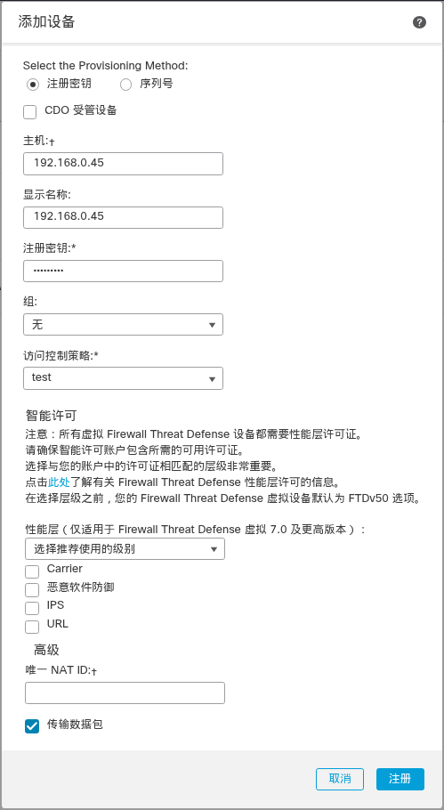
:::

设置以下参数:

- `主机 (Host)` - 输入要添加的防火墙的 IP 地址或主机名（如果可用）。如果不可用，请将此字段留空。
- `显示名称 (Display Name)` - 输入要在 管理中心 中显示的防火墙名称。之后将无法更改该名称。
- `注册密钥 (Registration Key)` - 输入您在防火墙初始配置中指定的注册密钥。
- `域 (Domain)` - 如果有多域环境，请将设备分配给分叶域。
- `组 (Group)` - 如果在使用组，则将其分配给设备组。
- `访问控制策略 (Access Control Policy)` - 选择初始策略。除非已经拥有您知道自己需要使用的自定义策略，否则选择 `新建策略 (Create new policy)`，然后选择 `阻止所有流量 (Block all traffic)`。之后您可以更改此设置以允许流量通过；请参阅 [配置访问控制规则](https://www.cisco.com/c/zh_cn/td/docs/security/firepower/quick_start/fp1010/fmc-local/cfp-1010-ftd-get-start_fmc-local/m_configure-a-basic-policy.html#configure-access-control)。

::: tabs key:英文中文
== 英文

== 中文
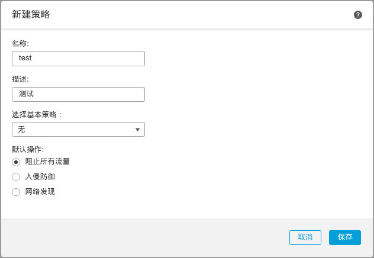
:::

- `智能许可` - 为要部署的功能分配所需的智能许可证。`注意：` 在添加设备后，您可以从 `系统 > 许可证 > 智能许可证` 页面应用 Secure Client 远程访问 VPN 许可证。
- `唯一 NAT ID (Unique NAT ID)` - 指定您在防火墙初始配置中指定的 NAT ID。
- `传输数据包 (Transfer Packets)` - 选中 `传输数据包 (Transfer Packets) 复选框`，以便对于每个入侵事件，设备将数据包传输到 管理中心 进行检查。
<br>
默认情况下，此选项已启用。对于每个入侵事件，设备会将事件信息和触发事件的数据包发送到 管理中心 进行检查。如果禁用此选项，则只会向 管理中心 发送事件信息，而不会发送数据包。

#### 步骤 4

点击 `Register`。

如果 威胁防御注册失败，请检查以下项：

- Ping - 访问 威胁防御 CLI（请参阅 [访问威胁防御 CLI](https://www.cisco.com/c/zh_cn/td/docs/security/firepower/quick_start/fp1010/fmc-local/cfp-1010-ftd-get-start_fmc-local/m_before-you-begin.html#access-the-threat-defense-cli)），然后使用以下命令 ping 管理中心 IP 地址：
<br>
`ping system` fmc_ip_address
<br>
如果 ping 不成功，使用 `show network` 命令检查网络设置。如果需要更改防火墙管理 IP 地址，请使用 `configure network {ipv4 | ipv6} manual` 命令。

- 注册密钥、NAT ID 和 管理中心 IP 地址 - 确保在两个设备上使用相同的注册密钥和 NAT ID。可以在防火墙上使用 `configure manager add` 命令设定注册密钥和 NAT ID。

有关更多故障排除信息，请参阅 https://cisco.com/go/fmc-reg-error 。

#### 等待防火墙更新
当注册成功后，FMC将会对防火墙进行更新

#### 防火墙查看管理
- 管理电脑/Minicom/
```bash
show managers
```
```log {5-8}
> show managers
Type                      : Manager
Host                      : 192.168.0.40
Display name              : 192.168.0.40
Version                   : 7.4.2 (Build 172)
Identifier                : f7dc6cd2-633c-11f0-a89d-df27a2da9458
Registration              : Completed
Management type           : Configuration and analytics
```

### 连接到路由器
将防火墙 `Ethernet1/1` 接口连接到路由器，之后将要在 管理中心(FMC) 进行配置


### 管理中心上配置防火墙接口
::: info
- 防火墙首次注册到FMC，接口 `Ethernet1/2 - 8` 默认 自动关闭
- 打开接口
- 添加桥接组接口
:::

选择 `设备` > `设备管理` > `<新添加的设备>` > `接口`
#### 步骤 1
编辑物理接口
- 编辑 `Ethernet1/1`
- 添加名称
- 启用
- 新建安全区并选择

::: tabs
== 图1 ->
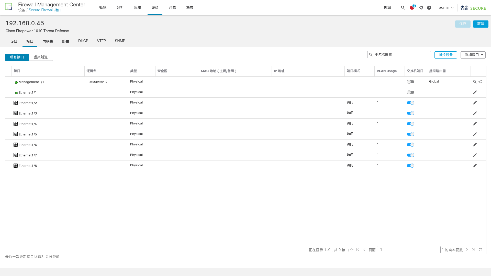
== 图2 ->
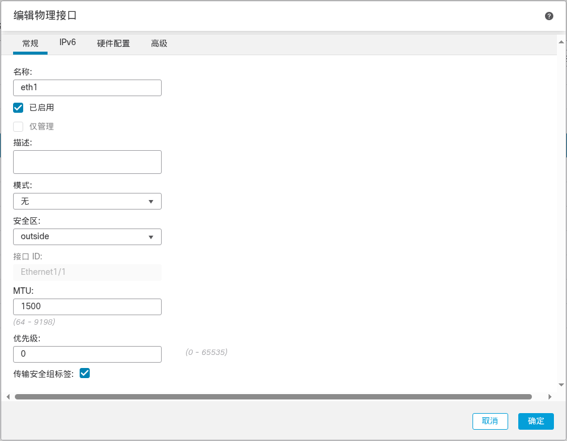
== 图3
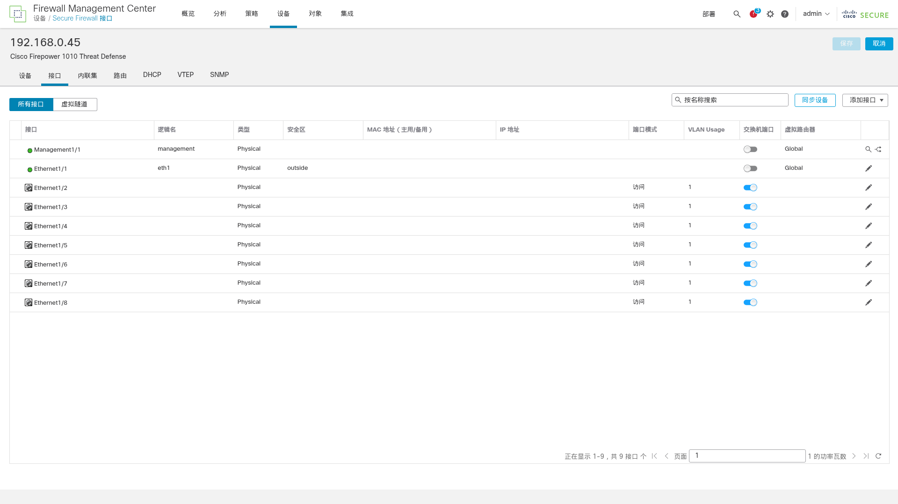
:::

- 编辑另一个需要连接外网的接口，这里以 `Ethernet1/2` 为例
- 关闭 `交换机端口`
- 添加名称
- 启用
- 新建安全区并选择

::: tabs
== 图1 ->

== 图2 ->
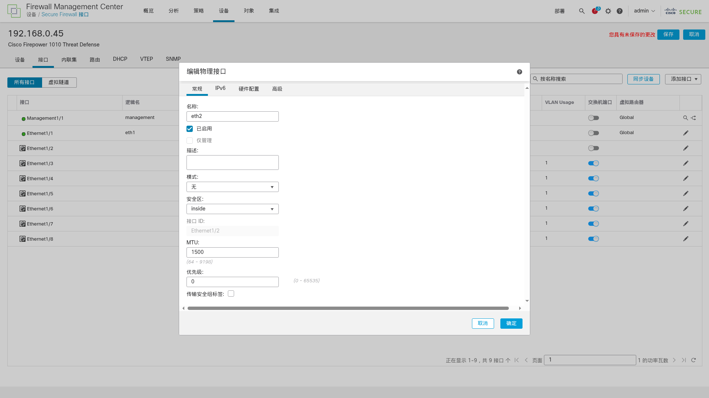
== 图3
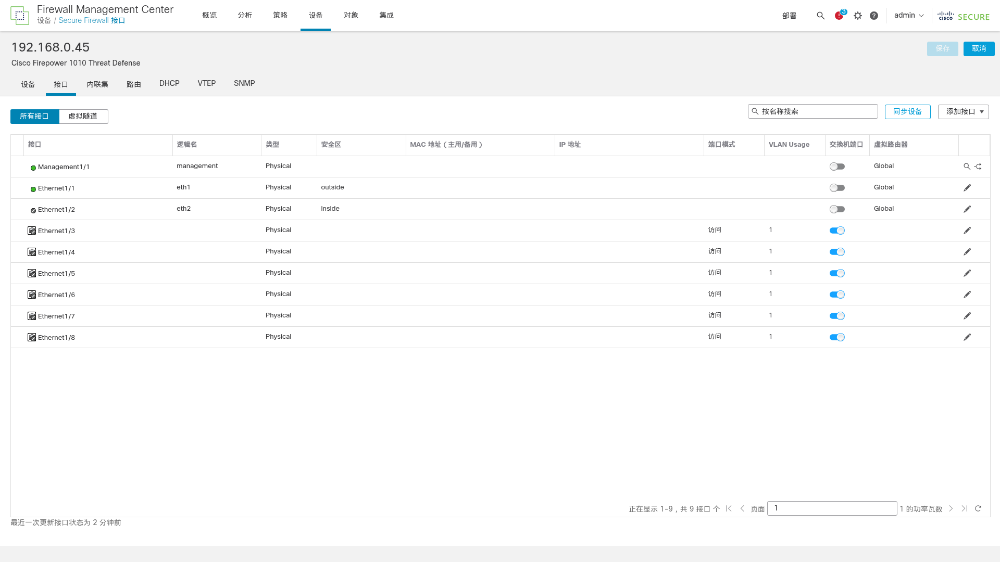
:::

#### 步骤 2
添加桥组接口
- `添加接口` > `桥组接口`
- 填写桥接组ID
- 选择接口 `Ethernet1/1` `Ethernet1/2`
- 添加 IPV4地址

::: tabs
== 图1 ->
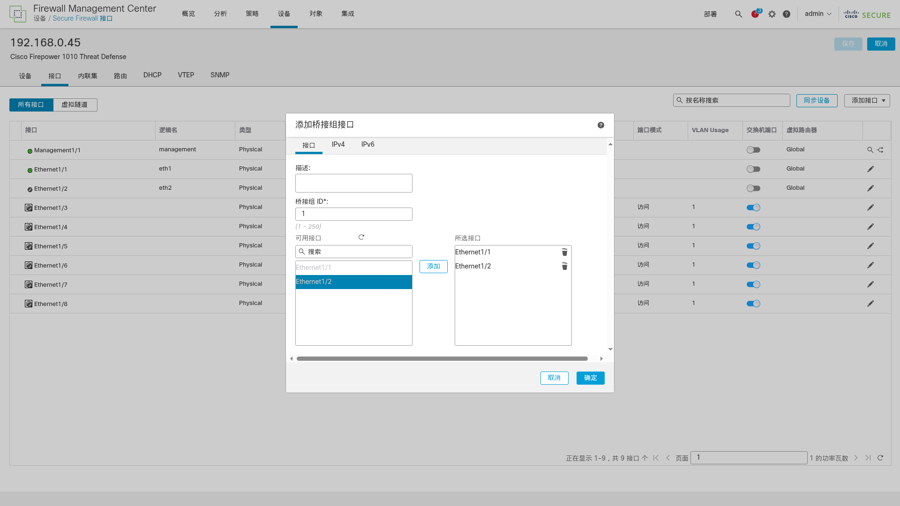
== 图2 ->
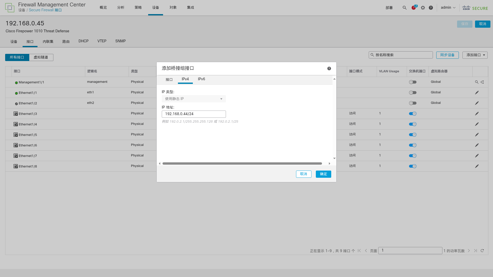
== 图3
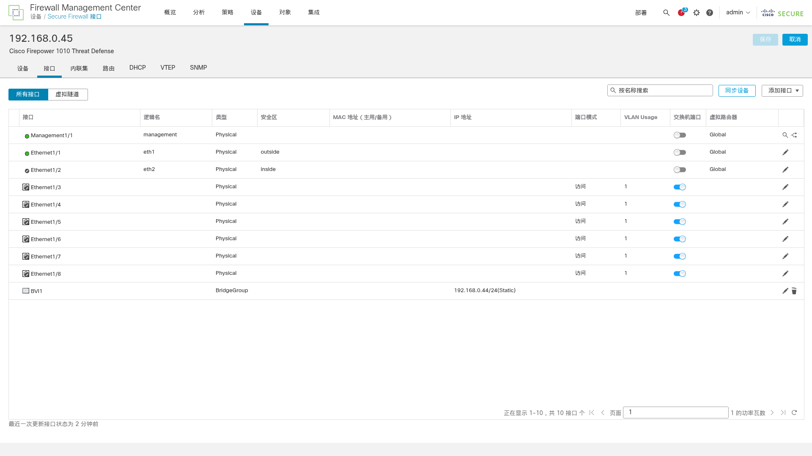
:::

#### 步骤 3
- 部署到防火墙
- 将电脑连接到 `Ethernet1/2`
- 测试连接外网
::: tabs
== 图1 ->
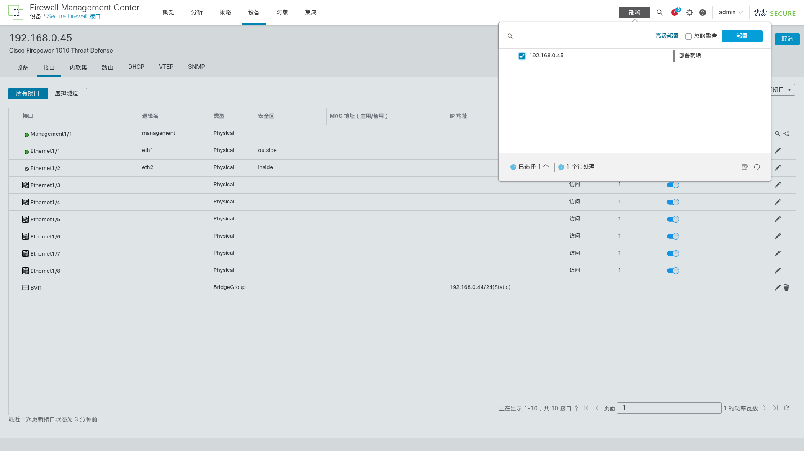
== 图2 ->

== 图3
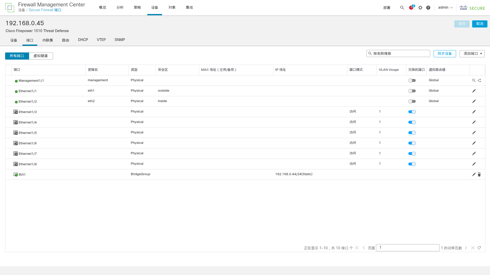
:::


::: tip 注意
- 确认更改的配置需要 `右上保存`
- 如果之前没有策略，在添加设备时创建的策略 默认是 `阻止所有流量`
- 接口配置完成后应该去修改策略，`策略` > `访问控制` > `访问控制`
- 任何对防火墙配置的修改，都要 `部署` 来应用这些修改
- 如果 `Ethernet1/2` 不能联网，可以更换成其他接口，记得要添加到 `桥组接口`
:::


---

# 结束
::: info [返回顶部](#cisco-firepower-1010)
:::
