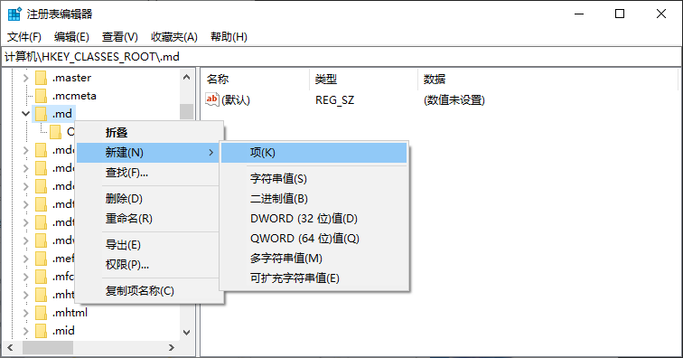
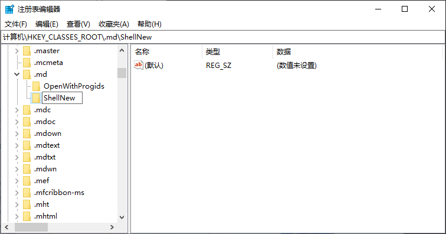
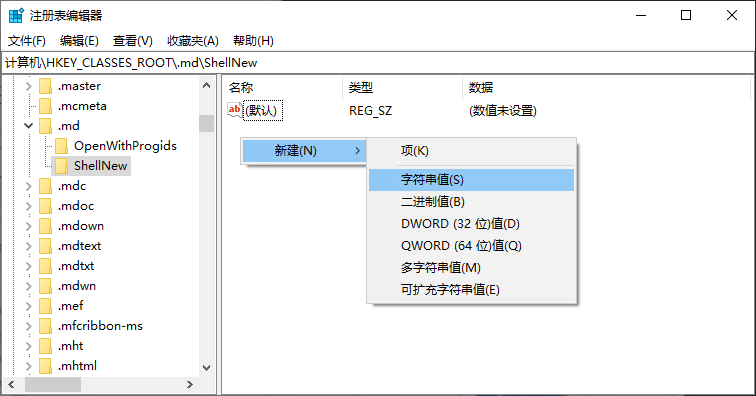
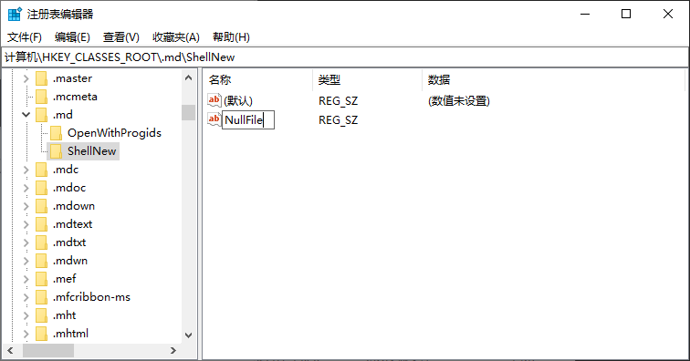
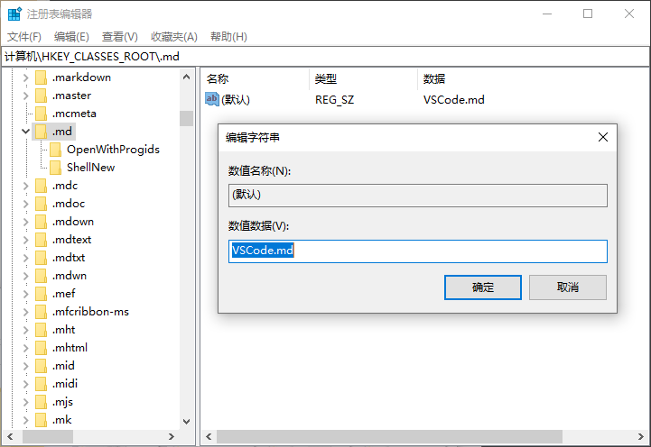

# 右键创建自定义后缀文件

::: tip 提示
- 这里以 .md 文件为例
- 安装有 [Visual Studio Code](https://visualstudio.microsoft.com/zh-hans/)
:::

## 打开 注册表编辑器
找到此目录
```c
计算机\HKEY_CLASSES_ROOT\.md
```

## 选择 .md 右键新建 项 ShellNew



## ShellNew 中新建 字符串值 NullFile



## 回到 计算机\HKEY_CLASSES_ROOT\.md
将 (默认) 的 数值数据 改成 VSCode.md
```c
VSCode.md
```
