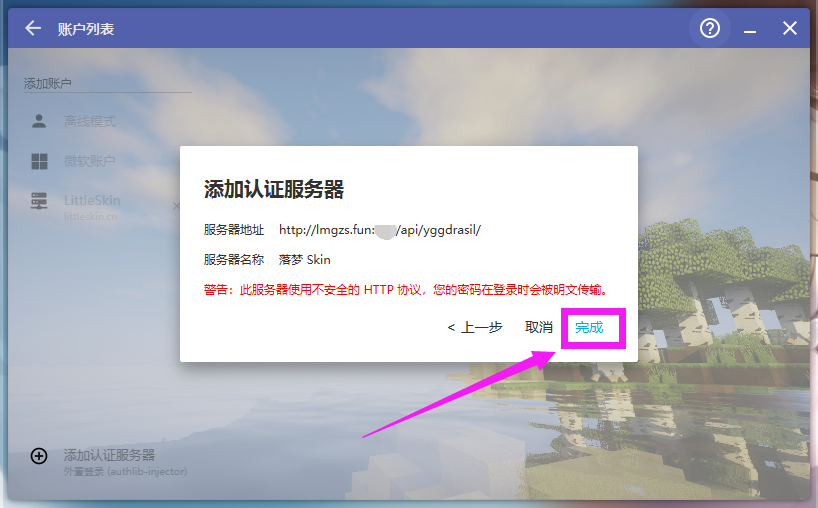
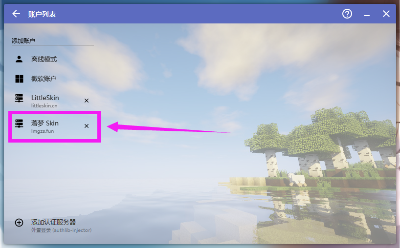
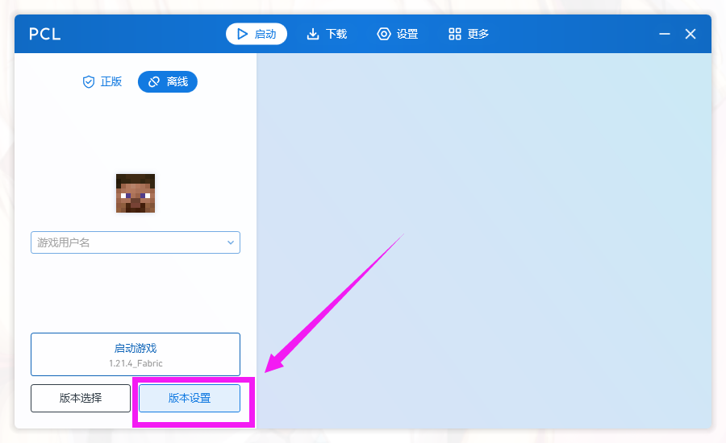
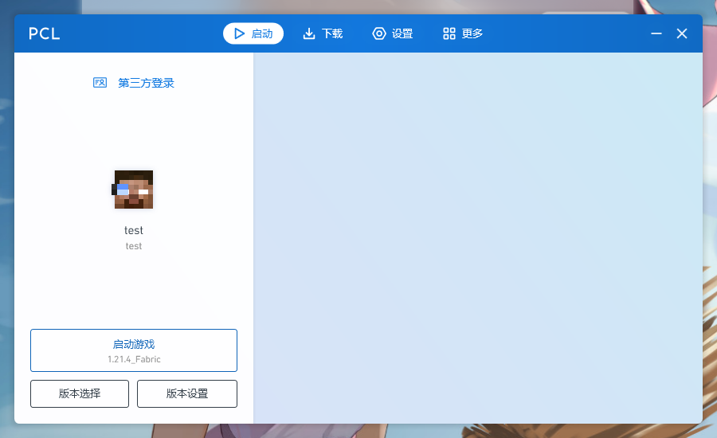

# 4. 给启动器添加认证服务器

::: info ♬详细教程
:::

- 本站的 Yggdrasil API 认证服务器地址：http://lmgzs.fun:888/api/yggdrasil
```c
http://lmgzs.fun:888/api/yggdrasil
```

## 你可以在皮肤站这里查看认证服务器地址


## HMCL 启动器

### 打开启动器
::: info 点击账户

::: 

### 添加认证服务器
::: info 添加认证服务器

:::

::: info 填入 `http://lmgzs.fun:888/api/yggdrasil`
```c
http://lmgzs.fun:888/api/yggdrasil
```

:::

::: info 点击完成

:::


### 登录认证服务器
::: info 点击新添加的认证服务器

:::

::: info 登录之前注册好的账户

:::

### 完成
::: info 返回启动器主页 如果有合适的游戏版本 即可开始游戏

:::


## PCL 启动器

::: tip PCL 启动器 需要有一个游戏版本才能添加 认证服务器
需要完成以下步骤再回来添加认证服务器
- [下载Minecraft](./5.0-下载Minecraft.md)
:::

### 打开启动器
::: info 点击账户

:::

### 添加认证服务器
::: info 添加认证服务器
- 点击设置
- 服务器 - 登录方式 - 第三方登录
- 服务器 - 认证服务器 - `http://lmgzs.fun:888/api/yggdrasil`
```c
http://lmgzs.fun:888/api/yggdrasil
```

- 其他可选
- 填写完成后返回启动器主页


:::

### 登录认证服务器
::: info 登录之前注册好的账户

:::

::: info 选择角色名字

:::

### 完成
::: info 即可开始游戏

:::


