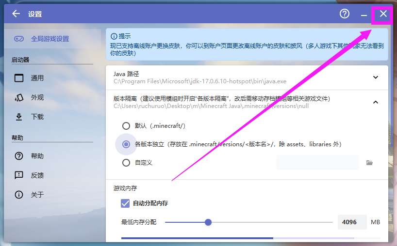
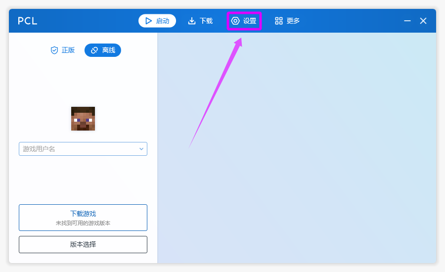

# 5.2 设置版本隔离

::: info ♬详细教程
:::

## HMCL 启动器

### 打开启动器
::: info 点击设置

:::

### 全局游戏设置
::: info 版本隔离

:::

::: info 各版本独立

:::

### 重启 启动器
::: info 关闭启动器，再打开启动器，回到这个界面，确保版本隔离生效

:::

## PCL 启动器

### 打开启动器
::: info 点击设置

:::

### 启动选项
::: info 隔离所有版本

:::

### 重启 启动器
::: info 关闭启动器，再打开启动器，回到这个界面，确保版本隔离生效

:::
