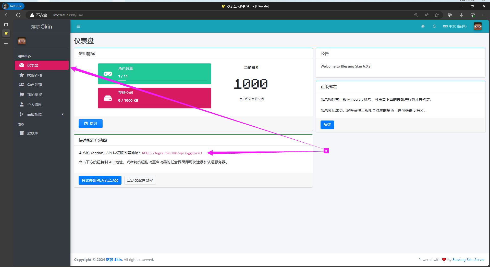
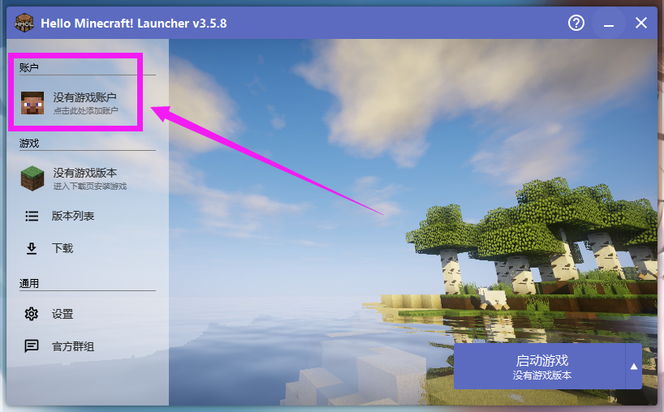
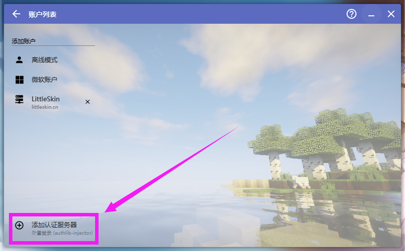
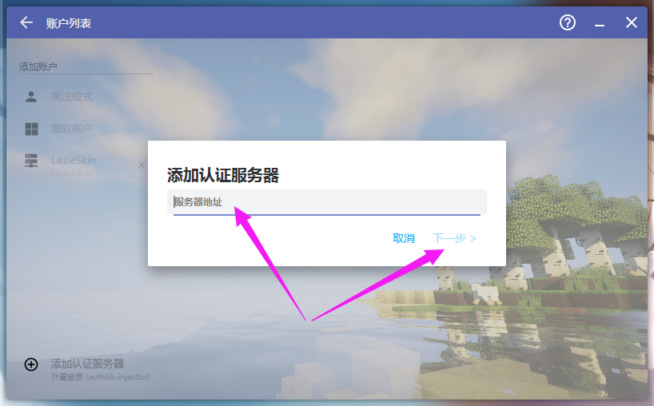
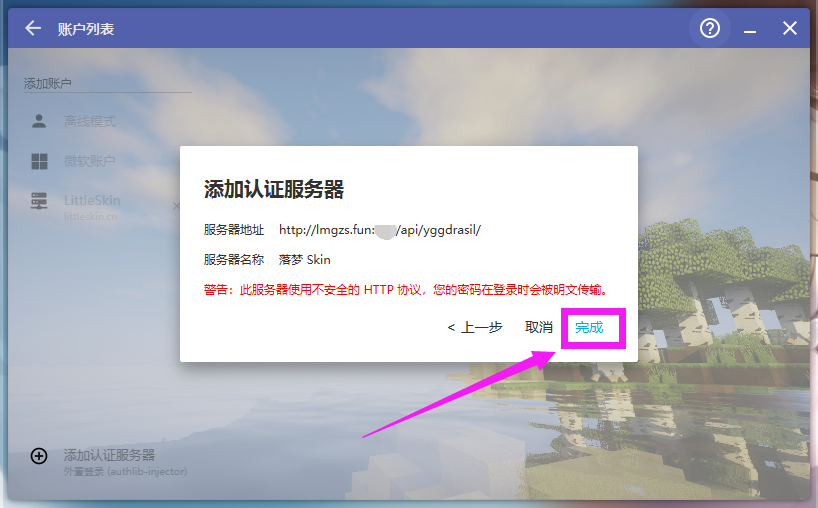
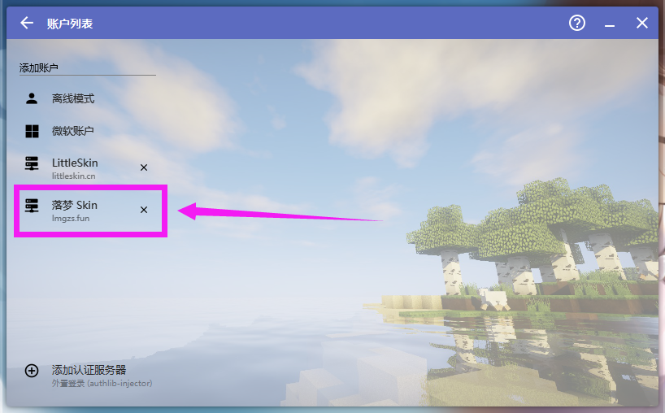
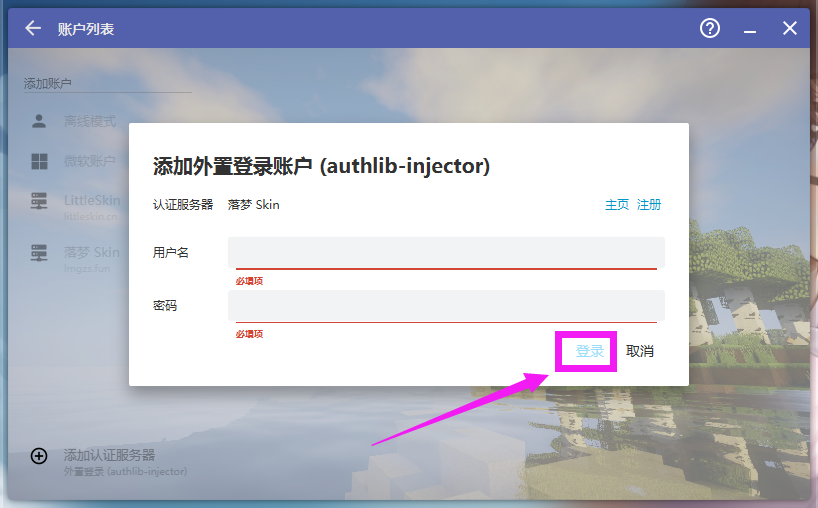
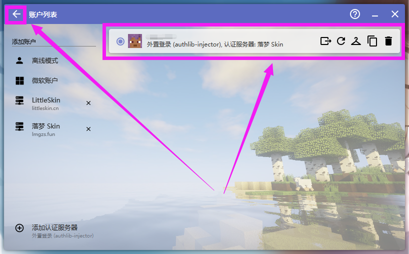

# 4. 给启动器添加认证服务器

::: info ♬详细教程
:::

- 本站的 Yggdrasil API 认证服务器地址：http://lmgzs.fun:888/api/yggdrasil
```c
http://lmgzs.fun:888/api/yggdrasil
```

### 你可以在皮肤站这里查看认证服务器地址


---

### 以下是HMCL启动器

#### 打开启动器 点击账户


---

#### 添加认证服务器


---

#### 填入 http://lmgzs.fun:888/api/yggdrasil
```c
http://lmgzs.fun:888/api/yggdrasil
```


---

#### 完成


---

#### 点击新添加的认证服务器


---

#### 添加之前注册好的账户


---

#### 这是添加好的样子
