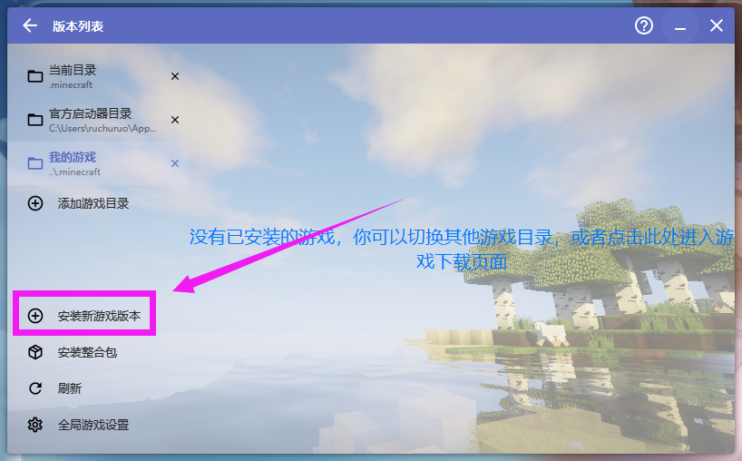
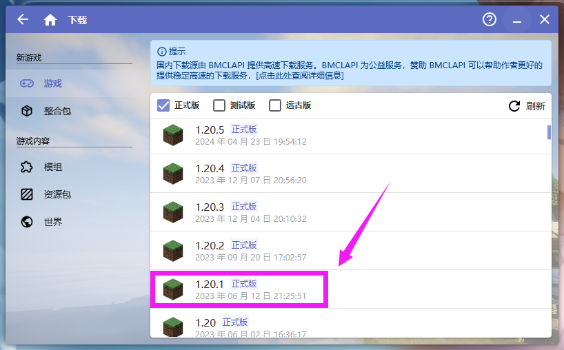
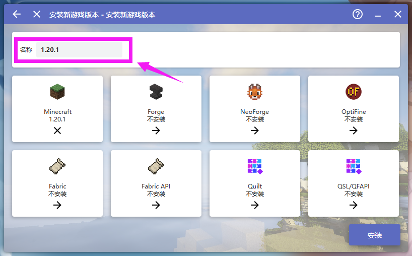
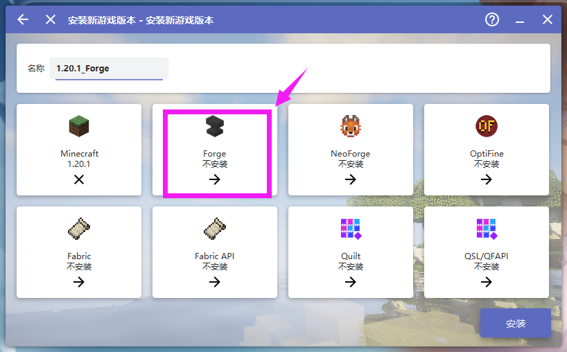
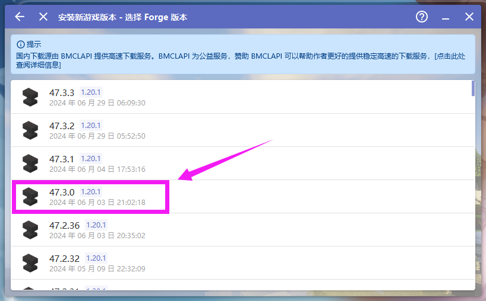
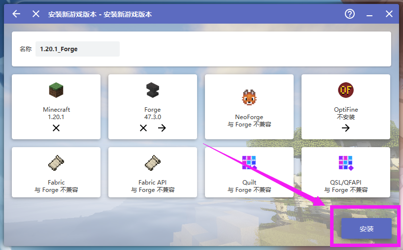
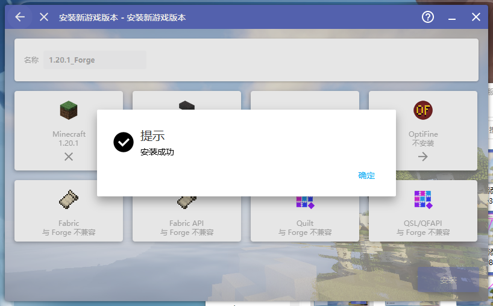
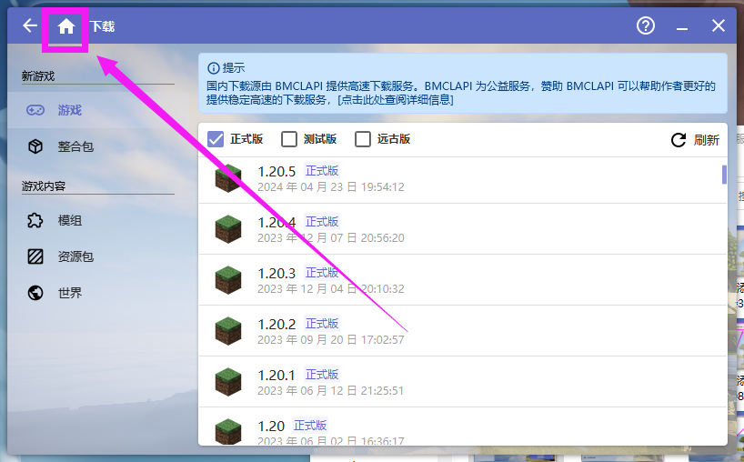
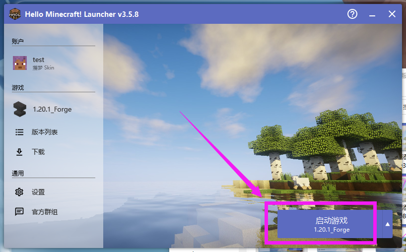

# 5.3 下载Minecraft

::: info ♬详细教程
:::

### 打开启动器 点击游戏版本


---

### 安装新游戏版本


---

### 1.20.1


---

### 可以修改名字


---

### 安装forge


---

### 安装forge 47.3.0


---

### 安装


---

### 完成


---

### 返回


---

### 你现在的目录应该是这样的
```c
└─Minecraft Java
    ├─.minecraft
    │  │  launcher_profiles.json
    │  │
    │  ├─assets
    │  ├─libraries
    │  └─versions
    │      └─1.20.1_Forge
    │              1.20.1_Forge.jar
    │              1.20.1_Forge.json
    │
    └─HMCL
            hmcl.json
            HMCL-3.5.8.exe
```

---

### 启动一次游戏，之后关闭游戏，用来生成一些文件夹
