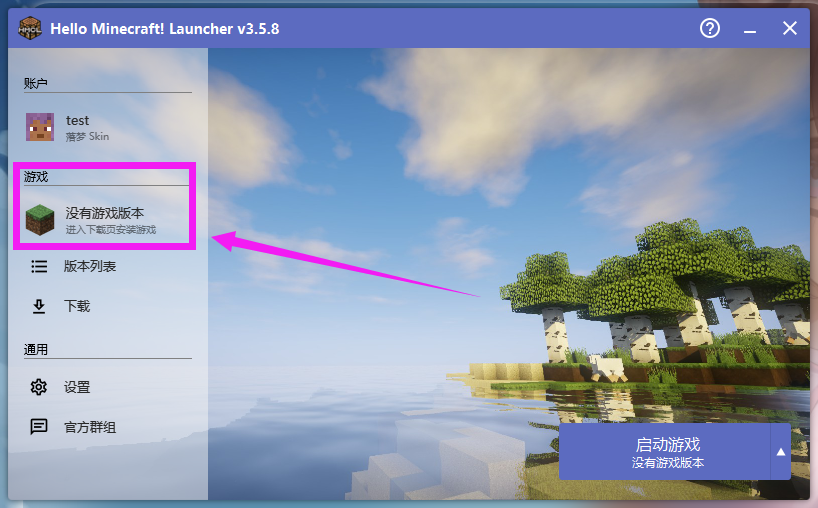
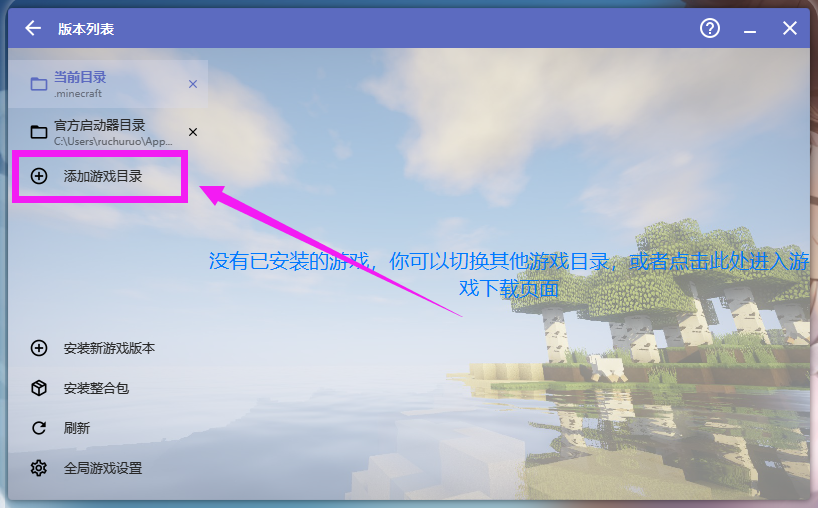
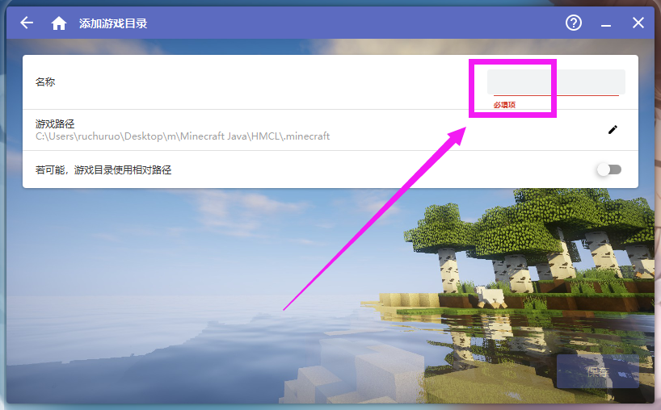
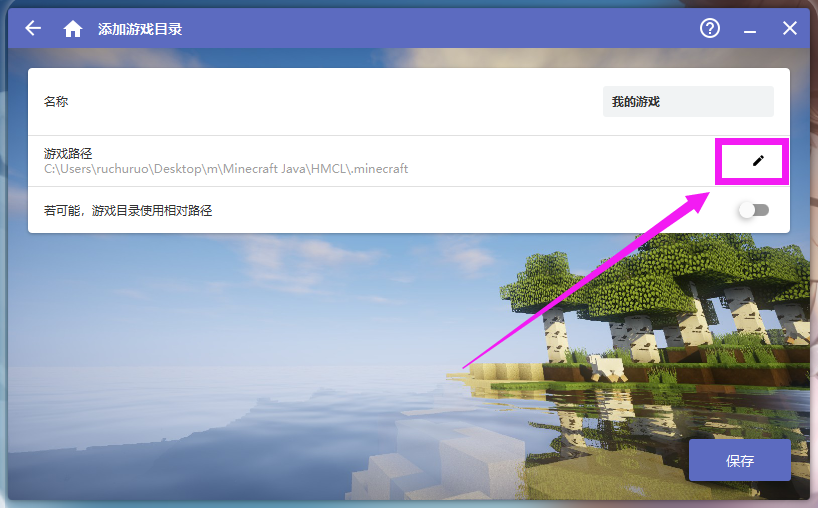
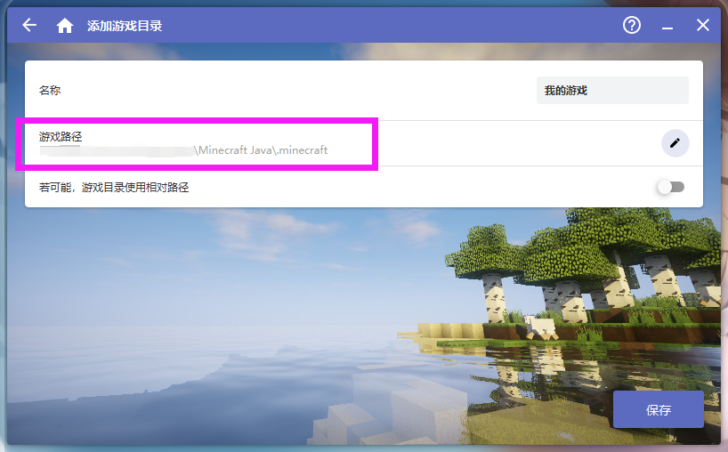
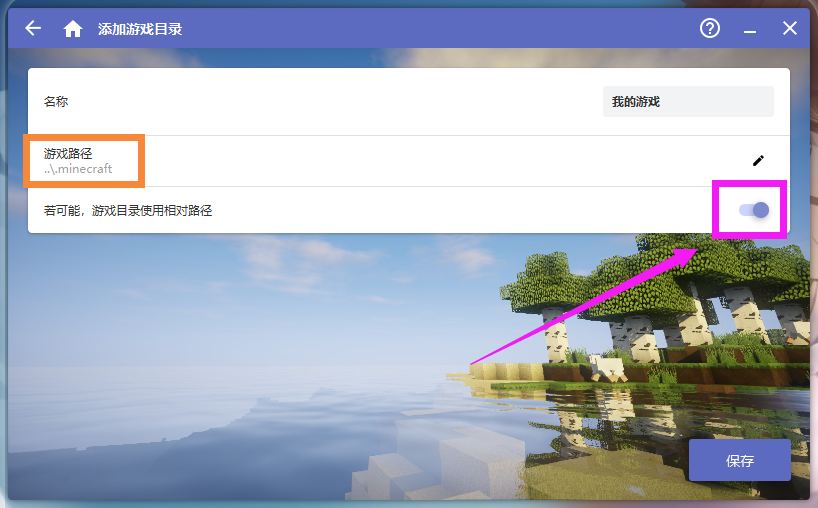
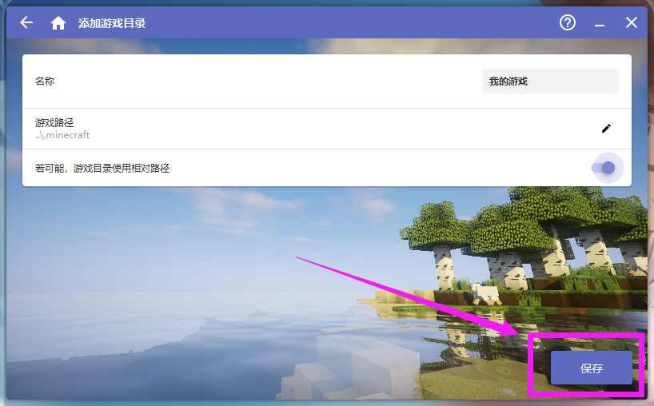
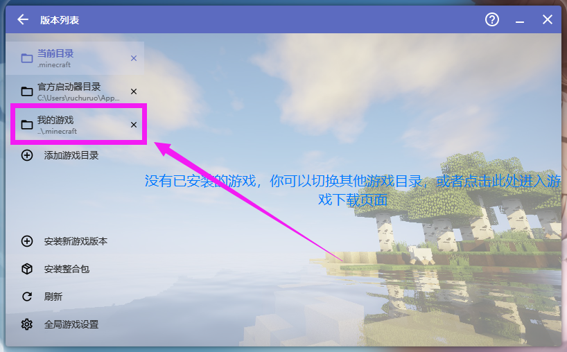
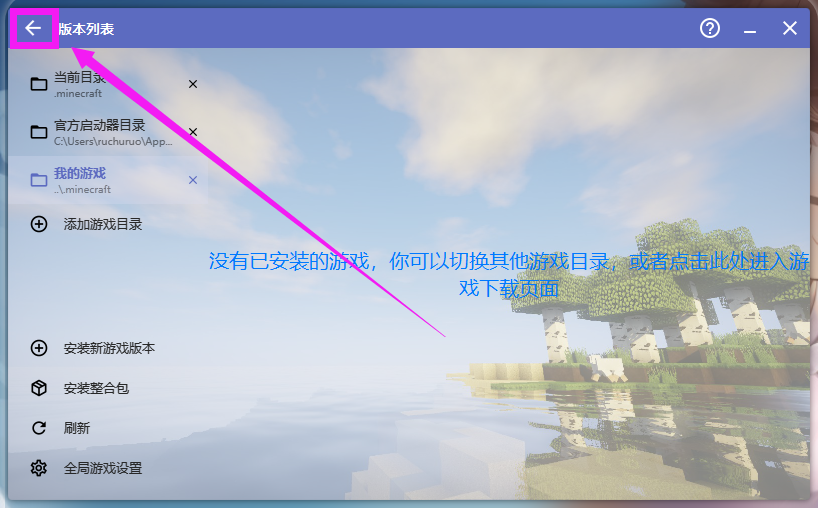

# 5.1 添加游戏目录

::: info ♬详细教程
:::

::: tip 提示
如果你选择默认路径(当前路径) 本页操作可以跳过
:::

---

### 打开启动器 点击游戏版本


---

### 添加游戏目录


---

### 填写名称方便认识


---

### 修改路径


::: tip 提示
如果你的文件夹的内容和我的一样，将会是这样的

没有 .minecraft 文件夹需要自行创建
```c
└─Minecraft Java
    ├─.minecraft
    └─HMCL
            hmcl.json
            HMCL-3.5.8.exe
```

:::

---

### 打开使用相对路径 方便移动


---

### 保存


---

### 选择刚创建的目录


---

### 返回
