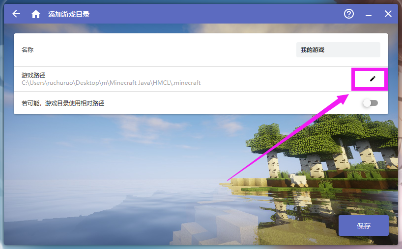
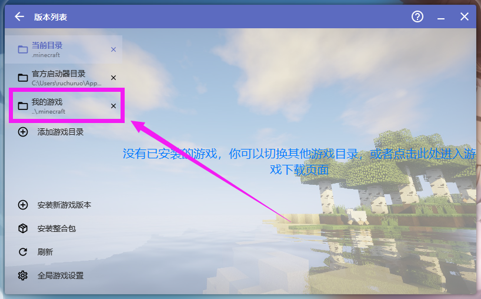
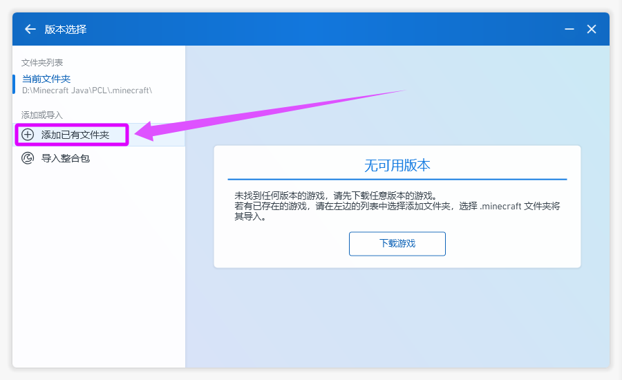
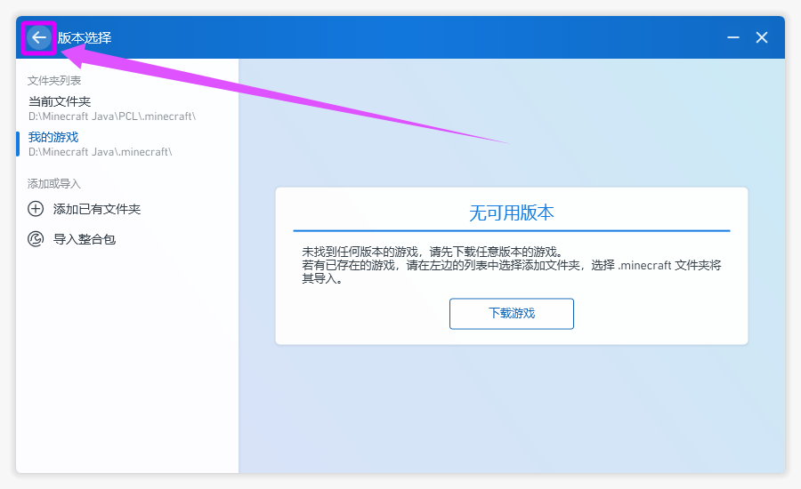

# 5.1 添加游戏目录

::: info ♬详细教程
:::

::: tip 提示
如果你选择默认路径(当前路径) 本页操作可以跳过
:::

## HMCL 启动器

### 打开启动器
::: info 点击游戏版本

:::


### 添加游戏目录
::: info 添加游戏目录

:::


### 填写名称
::: info 填写名称方便认识

:::

### 修改路径
::: info 自定义游戏目录

:::

::: tip 提示
如果你的文件夹的内容和我的一样，将会是这样的

没有 .minecraft 文件夹需要自行创建
```c
└─📁Minecraft Java
   ├─📁.minecraft
   ├─📁HMCL
   |      📄hmcl.json                              启动器配置文件
   |      ▶️HMCL-<version>.exe                    启动器
   |
   └─📁PCL
       |  ▶️Plain Craft Launcher <version>.exe    启动器
       |
       └─📁PCL                                     启动器配置文件夹
```

:::

### 设置相对路径
::: info 打开使用相对路径 方便移动

:::

### 保存
::: info 保存

:::

### 选择目录
::: info 选择新创建的目录

:::

### 返回
::: info 返回

:::


## PCL 启动器

### 打开启动器
::: info 点击游戏版本

:::

### 添加游戏目录
::: info 添加游戏目录

:::
::: tip 提示
如果你的文件夹的内容和我的一样，将会是这样的

没有 .minecraft 文件夹需要自行创建
```c
└─📁Minecraft Java
   ├─📁.minecraft
   ├─📁HMCL
   |      📄hmcl.json                              启动器配置文件
   |      ▶️HMCL-<version>.exe                    启动器
   |
   └─📁PCL
       |  ▶️Plain Craft Launcher <version>.exe    启动器
       |
       └─📁PCL                                     启动器配置文件夹
```
:::

### 填写名称
::: info 填写名称方便认识

:::

### 返回
::: info 返回

:::

