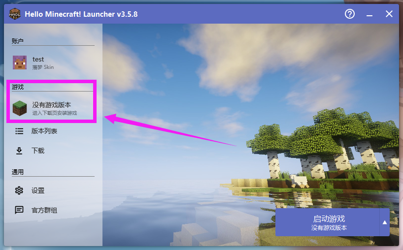
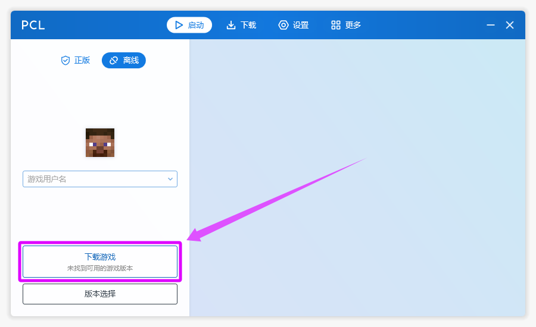
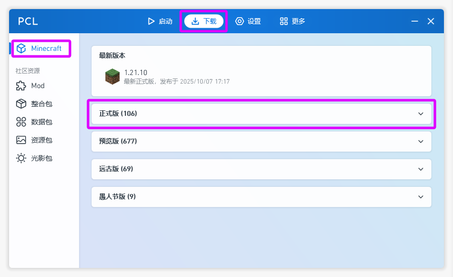
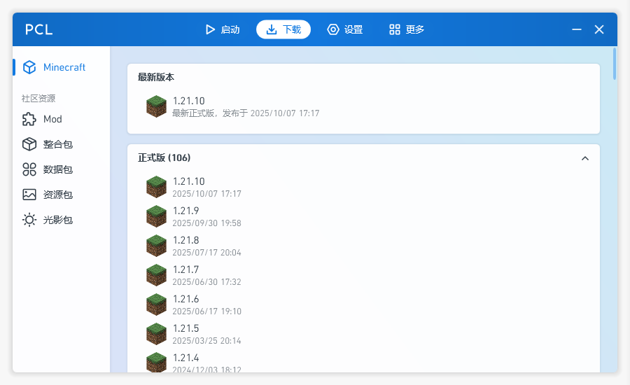
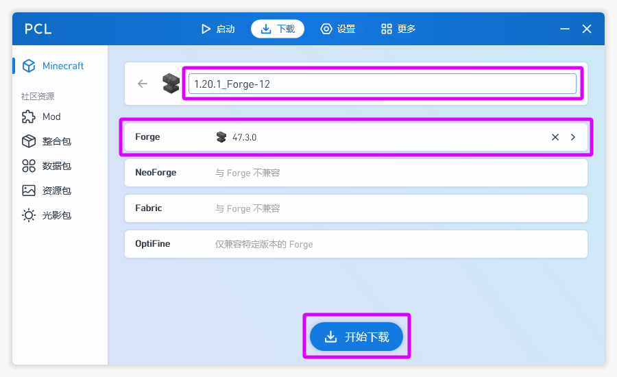
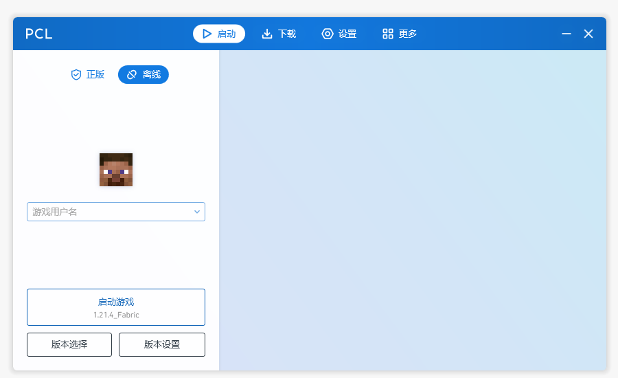

# 5.3 下载Minecraft

::: info ♬详细教程
:::

## HMCL 启动器

### 打开启动器
::: info 点击游戏版本

:::

### 选择安装游戏版本
::: info 安装新游戏版本

:::
::: info 选择合适的游戏版本

:::
::: info 可以修改名字

:::
::: info 模组加载器 Forge

:::

### 安装
::: info 安装

:::
::: info 完成

:::

### 返回
::: info 返回

:::

### 目录结构
你现在的目录应该是这样的
```c
└─📁Minecraft Java
   ├─📁.minecraft
   │   │      📄launcher_profiles.json
   │   │
   │   ├─📁assets
   │   ├─📁libraries
   │   └─📁versions
   │       └─📁1.20.1_Forge
   │              ☕1.20.1_Forge.jar
   │              📄1.20.1_Forge.json
   |
   ├─📁HMCL
   |      📄hmcl.json                              启动器配置文件
   |      ▶️HMCL-<version>.exe                    启动器
   |
   └─📁PCL
       |  ▶️Plain Craft Launcher <version>.exe    启动器
       |
       └─📁PCL                                     启动器配置文件夹
```

### 启动一次游戏
::: info 如果要安装 材质包/光影/模组，可以启动一次游戏，之后关闭游戏，用来生成一些文件夹

:::


## PCL 启动器

### 打开启动器
::: info 下载游戏

:::

### 选择下载游戏版本
::: info 查看正式版

:::
::: info 选择 1.20.1

:::
::: info 可以修改名字 模组加载器 Forge

:::

### 目录结构
你现在的目录应该是这样的
```c
└─📁Minecraft Java
   ├─📁.minecraft
   │   │      📄launcher_profiles.json
   |   |      📄PCL.ini
   │   │
   │   ├─📁assets
   │   ├─📁libraries
   │   └─📁versions
   │       └─📁1.20.1_Forge
   │              ☕1.20.1_Forge.jar
   │              📄1.20.1_Forge.json
   |
   ├─📁HMCL
   |      📄hmcl.json                              启动器配置文件
   |      ▶️HMCL-<version>.exe                    启动器
   |
   └─📁PCL
       |  ▶️Plain Craft Launcher <version>.exe    启动器
       |
       └─📁PCL                                     启动器配置文件夹
```

### 启动一次游戏
::: tip PCL 启动器 需要有一个游戏版本才能添加 认证服务器
回去添加认证服务器
- [给启动器添加认证服务器#pcl-启动器](./4-给启动器添加认证服务器.md#pcl-启动器)
:::
::: info 如果要安装 材质包/光影/模组，可以启动一次游戏，之后关闭游戏，用来生成一些文件夹

:::
