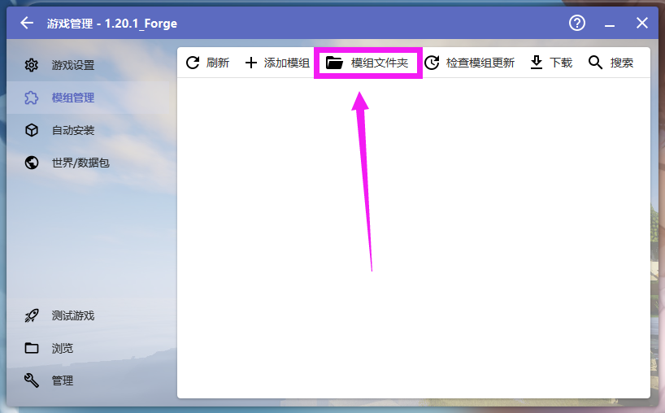
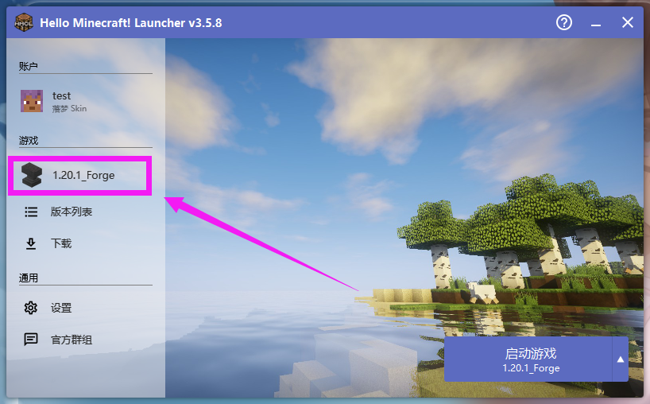
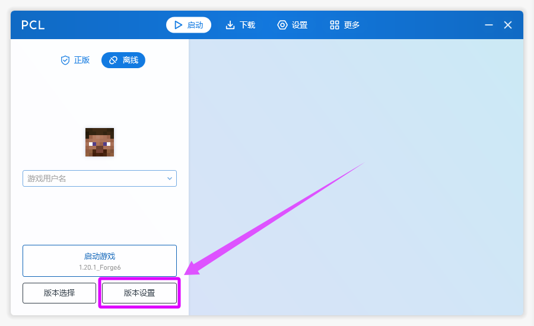
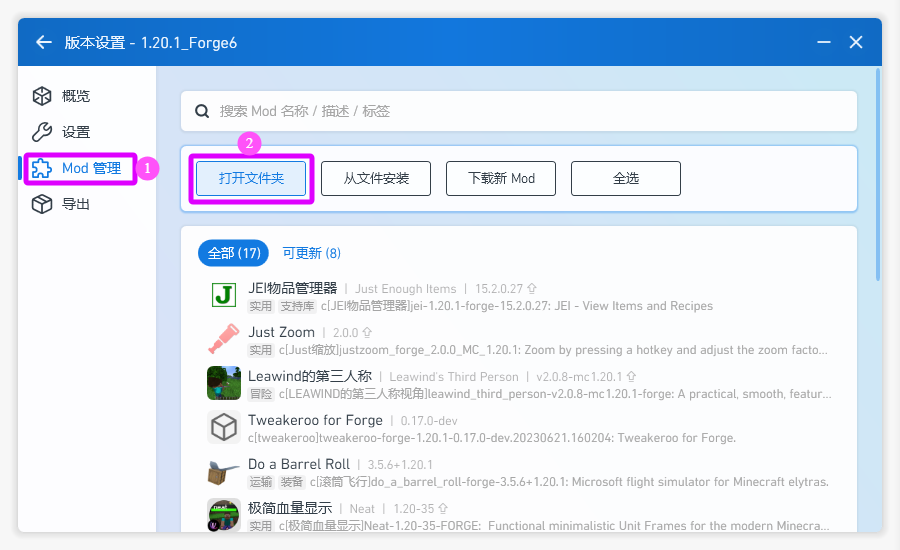

# 6. 安装特定模组

::: info ♬详细教程
:::

- 可以去这里下载 本站文件夹 [http://lmgzs.fun:440/](http://lmgzs.fun:440/files/%e6%88%91%e7%9a%84%e4%b8%96%e7%95%8c/Java/%e6%a8%a1%e7%bb%84/1.20.1/)

::: tip 提示
- 如果需要下载全部请选择 `必装模组.zip` 或 `必装模组.7z`
- 如果需要预览可以查看 `必装模组/`
- 如果需要自行下载可以查看 `模组来源/`
:::

## HMCL 启动器

### 启动器界面操作
::: info 打开启动器 点击游戏版本

:::
::: info 模组管理

:::
::: info 模组文件夹

:::

### 添加模组
::: info 将解压后的 .jar 文件放到此处

:::

## PCL 启动器

### 启动器界面操作
::: info 打开启动器 点击版本设置

:::
::: info Mod 管理 打开文件夹

:::

### 添加模组
::: info 将解压后的 .jar 文件放到此处

:::

