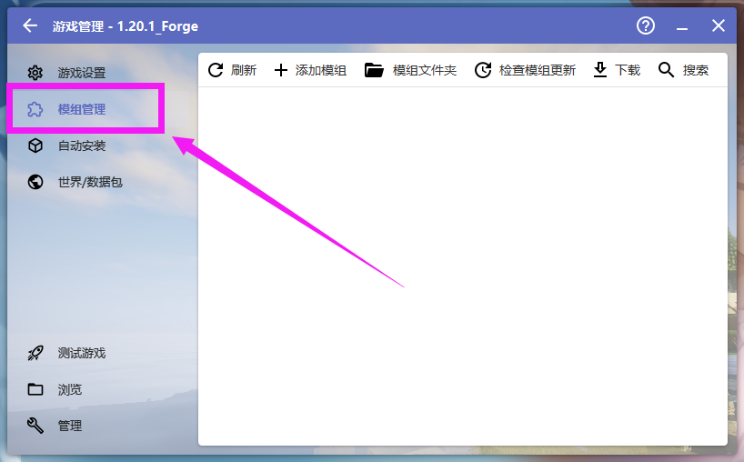
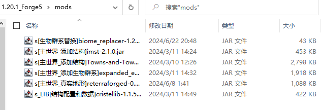

# 6. 安装特定模组

::: info ♬详细教程
:::

- 可以去这里下载 本站文件夹 [http://lmgzs.fun:444/](http://lmgzs.fun:444/files/%e6%88%91%e7%9a%84%e4%b8%96%e7%95%8c/Java/%e6%a8%a1%e7%bb%84/1.20.1/)

::: tip 提示
- 如果需要下载全部请选择 必装模组.zip
- 如果需要预览可以查看 必装模组/
- 如果需要自行下载可以查看 模组来源/
:::

### 打开启动器 点击游戏版本

---

### 模组管理

---

### 模组文件夹

---

### 将解压后的 .jar 文件放到此处
