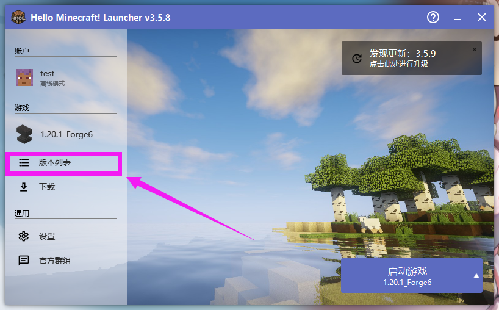
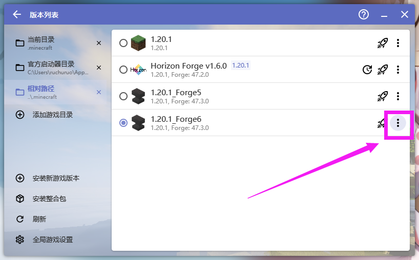
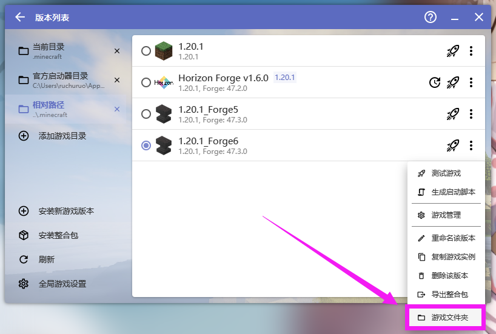
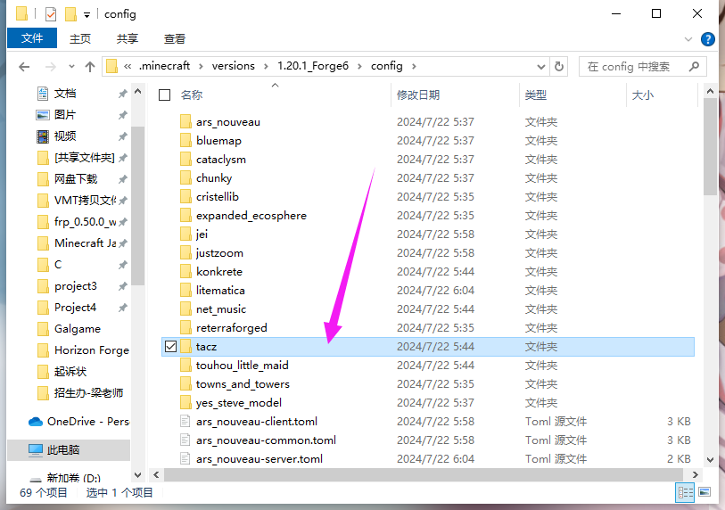

# 7. 安装枪包

::: info ♬详细教程
:::

::: tip 总共需要下载 2 个
:::

- 本站文件夹
 
①[http://lmgzs.fun:444/.../EMX逆境重科主包_converted.zip](http://lmgzs.fun:444/files/%e6%88%91%e7%9a%84%e4%b8%96%e7%95%8c/Java/%e5%bd%a2%e5%bd%a2%e8%89%b2%e8%89%b2%e7%9a%84%e6%a8%a1%e5%9e%8b/%e6%b0%b8%e6%81%92%e6%9e%aa%e6%a2%b0%e5%b7%a5%e5%9d%8a%ef%bc%9a%e9%9b%b6%20%e6%9e%aa%e5%8c%85/%e5%85%8d%e8%b4%b9/%5b%e9%80%86%e5%a2%83%e9%87%8d%e7%a7%91%e5%86%9b%e5%a4%87%5dEMX-Arms%20GunsPack/tacz1.1.4+/%5bneedTacz1.0.3%5dEMX-Arms-Gunpack%20ver0.5.5_converted.zip)
 
②[http://lmgzs.fun:444/.../民间枪匠附属包_converted.zip](http://lmgzs.fun:444/files/%e6%88%91%e7%9a%84%e4%b8%96%e7%95%8c/Java/%e5%bd%a2%e5%bd%a2%e8%89%b2%e8%89%b2%e7%9a%84%e6%a8%a1%e5%9e%8b/%e6%b0%b8%e6%81%92%e6%9e%aa%e6%a2%b0%e5%b7%a5%e5%9d%8a%ef%bc%9a%e9%9b%b6%20%e6%9e%aa%e5%8c%85/%e5%85%8d%e8%b4%b9/%5b%e9%80%86%e5%a2%83%e9%87%8d%e7%a7%91%e5%86%9b%e5%a4%87%5dEMX-Arms%20GunsPack/tacz1.1.4+/%5bneedEMX0.5.5+%5dEMX-Gunsmith%20ver0.0.5_converted.zip)

- 原地址
::: details 暂不支持 tacz 1.1.4
①[https://www.curseforge.com/.../EMX逆境重科主包](https://www.curseforge.com/minecraft/customization/tacz-emx-arms-gunpack)

②[https://www.curseforge.com/.../民间枪匠附属包](https://www.curseforge.com/minecraft/customization/tacz-emx-gunsmith-gunpack)
:::

## 安装枪包

### 打开启动器 点击版本列表

---

### 点击竖三点

---

### 点击游戏文件夹

---

### 点击 tacz 文件夹

---

### 将下载的枪包放到这里

---

::: tip 注意事项/说明
- 如果只有服务器安装枪包，客户端未安装枪包，则客户端显示 黑紫方块贴图
- 如果只有客户端安装枪包，服务器未安装枪包，则客户端无法使用枪包的物品
- 为什么不修改 [永恒枪械工坊]tacz 的配置文件让枪包自动下载，
因为无论使用什么方法都会显示"服务器发送了一个无效的数据包"，
即使使用了 Packet Fixer 类似的模组依然无效
:::