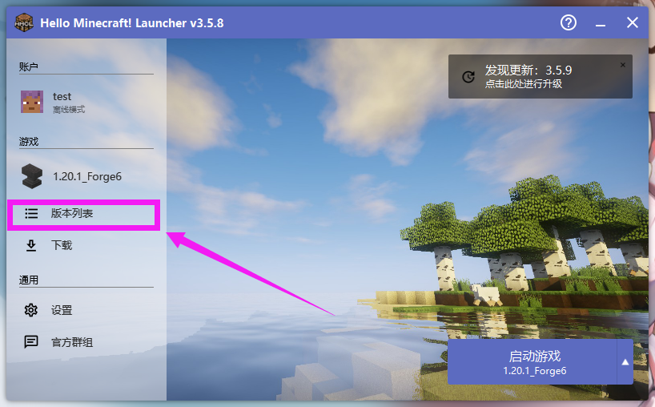
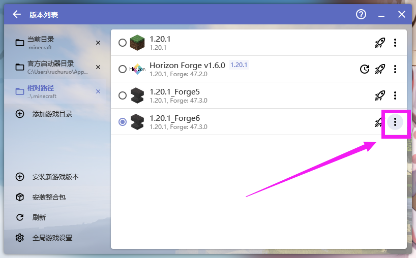
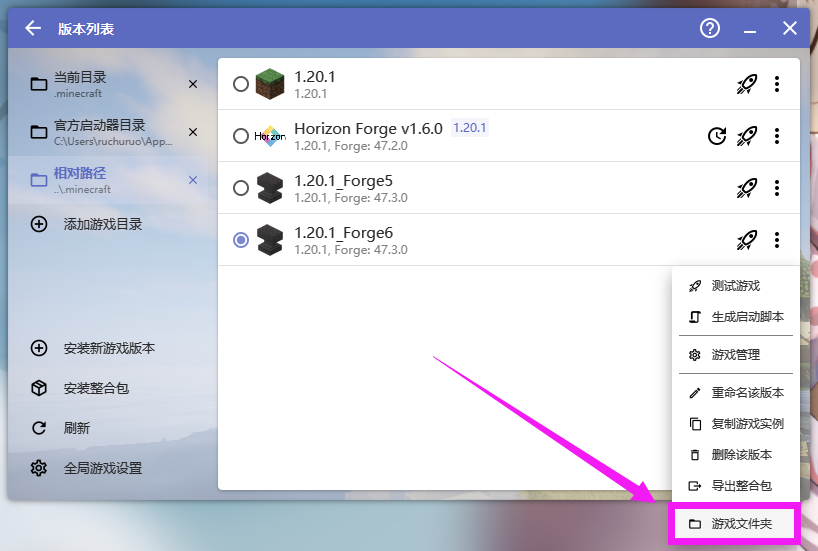
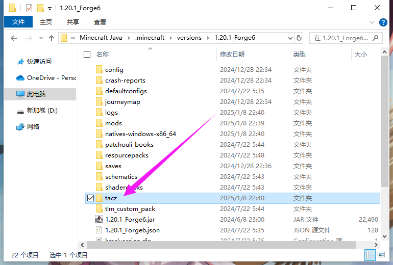
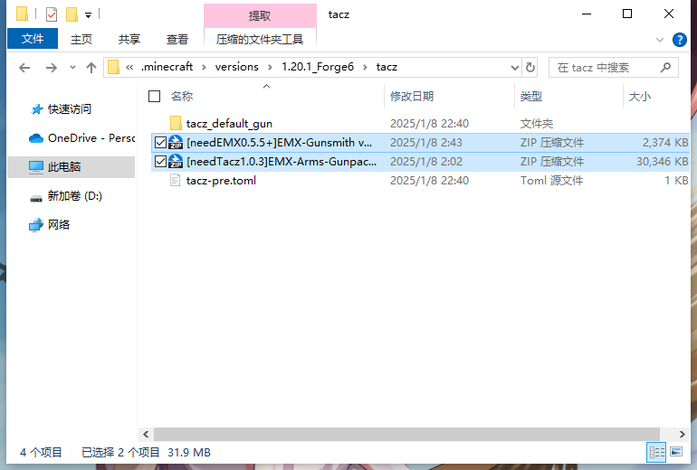
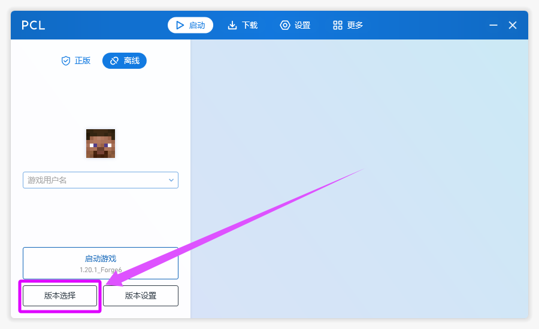
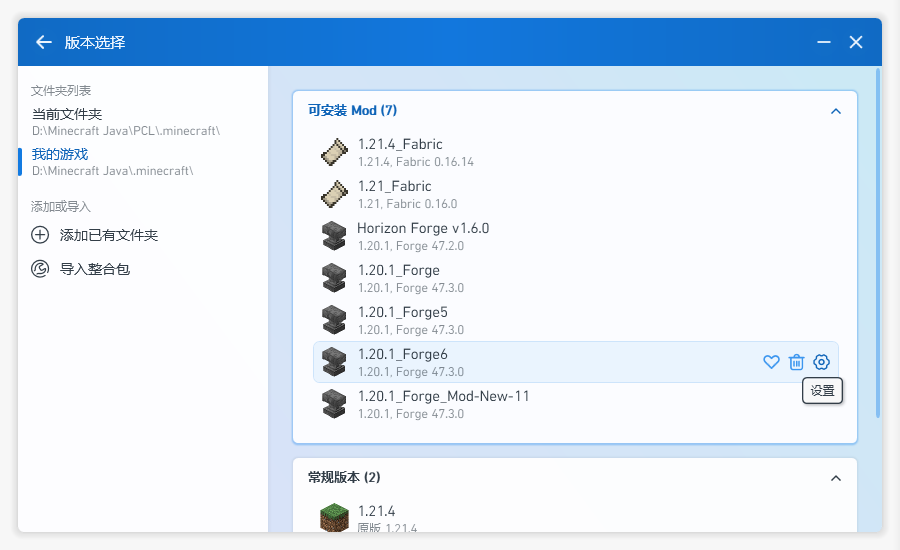
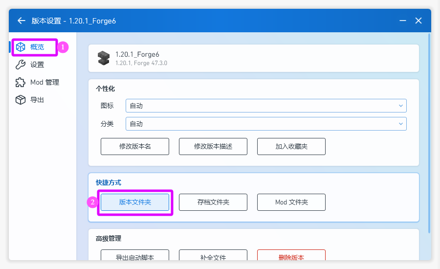

# 7. 安装枪包

::: info ♬详细教程
:::

::: tip 总共需要下载 6 个
:::

### 本站文件夹
- 本站文件夹 [http://lmgzs.fun:440/](http://lmgzs.fun:440/files/%e6%88%91%e7%9a%84%e4%b8%96%e7%95%8c/Java/%e6%a8%a1%e7%bb%84/1.20.1/)

::: details 原地址
建议从 本站文件夹 下载，因为枪包并不会及时更新
 
如果要从 原地址 下载，需要自己检查 枪包 的版本是否一致

---
[SF-2403](https://afdian.com/a/SF2403)
- ①[https://www.curseforge.com/.../EMX逆境重科主包](https://www.curseforge.com/minecraft/customization/tacz-emx-arms-gunpack)
- ②[https://www.curseforge.com/.../民间枪匠附属包](https://www.curseforge.com/minecraft/customization/tacz-emx-gunsmith-gunpack)
- ③[https://www.curseforge.com/.../TRIS天枢动力](https://www.curseforge.com/minecraft/customization/tacz-tris-dyna-gunpack)

---
[伊波Mikan](https://afdian.com/a/aaanjuinami)
- ④[https://www.curseforge.com/.../PGP英仙座](https://www.curseforge.com/minecraft/mc-addons/tacz-perseus-gun-pack)

---
[Rhodes_koei](https://afdian.com/a/koeiTaCZ)
- ⑤[https://www.curseforge.com/.../魔艺军械师](https://www.curseforge.com/minecraft/customization/tacz-ars-armorer-koei)

---
[shi_gure256](https://afdian.com/a/shi_yu256)
- ⑥[https://www.curseforge.com/.../EOSlab-曙光女神实验室](https://www.curseforge.com/minecraft/customization/tacz-eoslab-gunpack)
:::

## HMCL 启动器

### 启动器界面操作
::: info 打开启动器 版本列表

:::
::: info 点击竖三点

:::
::: info 游戏文件夹

:::

### 添加枪包
:::info 点击 tacz 文件夹

:::
:::info 将下载的枪包放到这里

:::

## PCL 启动器

### 启动器界面操作
::: info 打开启动器 版本选择

:::
::: info 我的游戏 找到需要安装枪包的版本 点击齿轮按钮

:::
::: info 概览 版本文件夹

:::

### 添加枪包
:::info 点击 tacz 文件夹

:::
:::info 将下载的枪包放到这里

:::

::: tip 注意事项/说明
- 如果只有服务器安装枪包，客户端未安装枪包，则客户端显示 黑紫方块贴图
- 如果只有客户端安装枪包，服务器未安装枪包，则客户端无法使用枪包的物品
- 枪包无法通过服务器自动下载安装，所以只能用户自行下载安装
- 暂时不需要 Packet Fixer 类似的模组
:::
