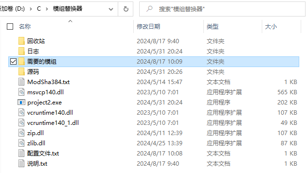
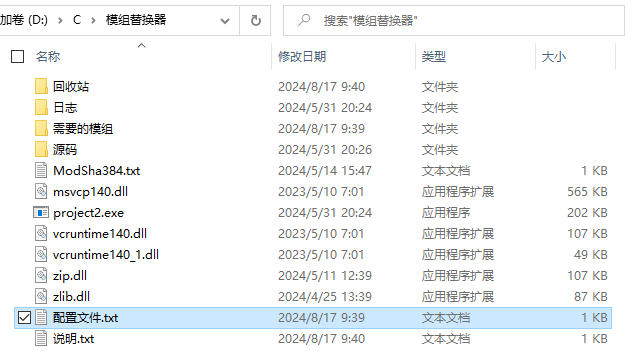
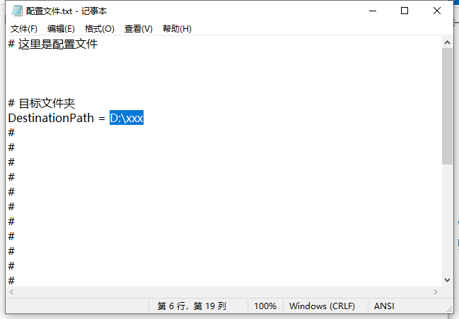
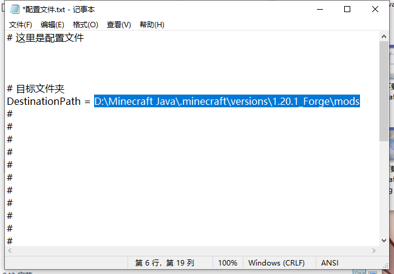
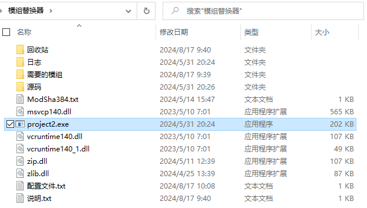
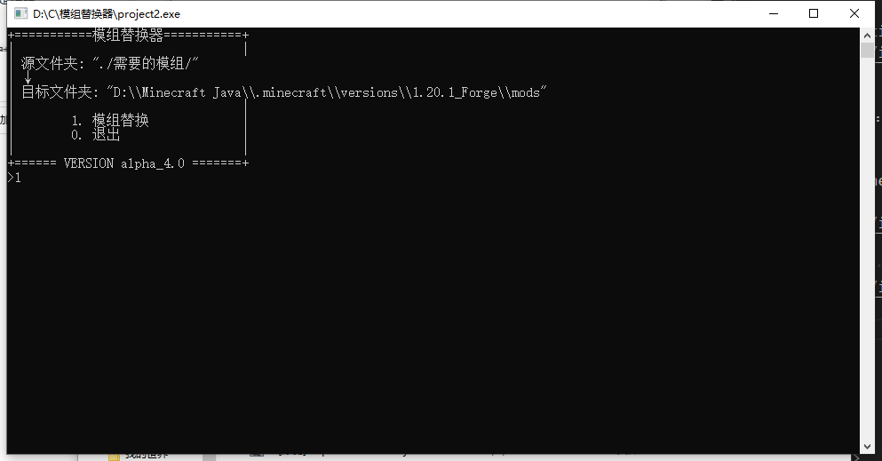
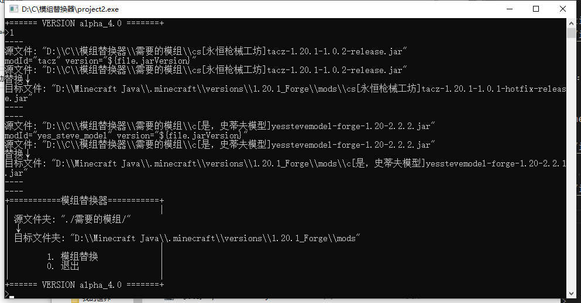
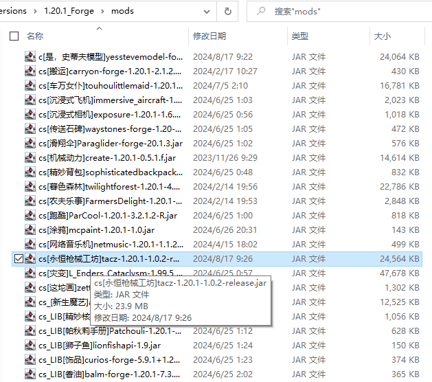

# 模组替换器使用教程

::: tip 提示
- 当有多个模组需要更新时
<br>
手动删除旧模组 和 手动添加新模组 是比较麻烦的事
<br>
- 本页中的图片看不清？鼠标右键 在新标签页中打开图像
:::

### 可以从这里下载到 模组替换器
- 本站文件夹 [http://lmgzs.fun:444/](http://lmgzs.fun:444/files/%e6%88%91%e7%9a%84%e4%b8%96%e7%95%8c/Java/%e6%a8%a1%e7%bb%84/1.20.1/)

::: tip 提示
它在 本站文件夹 内是一个 .zip的压缩文件
<br>
下载后解压 进入文件夹 它会是这样的
```c
模组替换器
│  ModSha384.txt
│  project2.exe
│  zip.dll
│  zlib.dll
│  说明.txt
│  配置文件.txt
│
├─回收站
│
├─日志
│
├─源码
│
└─需要的模组
```
:::

---

### 将新的模组放到 需要的模组 文件夹


---

### 放入后是这样的


---

### 之后需要打开 配置文件.txt 设置 DestinationPath 的值


---

### DestinationPath 的值需要设置为 mods文件夹所在路径


::: tip 提示
比如：
```c
D:\Minecraft Java\.minecraft\versions\1.20.1_Forge\mods
```

:::

---

### 保存 配置文件.txt 之后 启动 project2.exe
::: tip 提示
每次修改 配置文件.txt 之后都需要重新启动 project2.exe
:::


---

### 启动之后可以看到 目标文件夹
::: tip 提示
如果需要复制显示的文字，鼠标左键选中，鼠标右键复制，鼠标右键粘贴
<br>
CTRL + C 是结束
<br>
:::


---

### 输入数字选择需要执行的操作
::: tip 提示
输入 1 之后回车
:::


---

### 开始替换


---

### 替换成功，可以看到版本号变了
