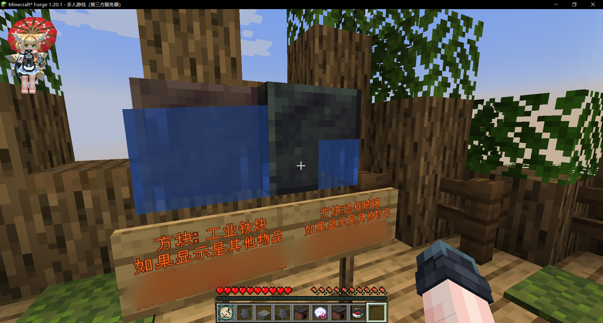
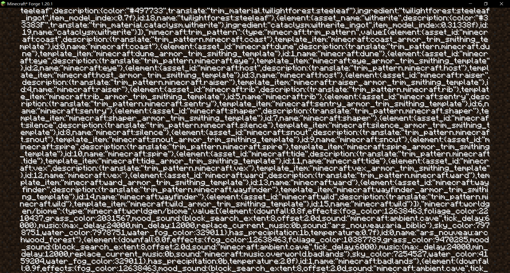

# ♬问答
---

### 本站文件夹 http://lmgzs.fun:440/ 是什么
::: info 答
这是我们搭建的文件存储网站
:::

### 皮肤站 http://lmgzs.fun:888/ 是什么
::: info 答
- 这是我们搭建的皮肤站，主要用途是用于登录游戏服务器，
- 这样可以省去在游戏内输入密码来登录，大大节省时间，更加方便。
- 用户设置的密码我们并不能查看到，所以请放心。
:::

### 为什么一启动游戏就崩溃？
::: info 答
把日志发出来，和你一起分析
:::

### 为什么不建议安装 OptiFine
::: info 答
- 在高版本中，许多模组都与 OptiFine 不兼容
- 如果之前的游戏版本安装过 OptiFine，
如果想要简单的清除掉 OptiFine，
删除该版本，重新下载
:::

### [永恒枪械工坊]tacz 的枪包为什么需要手动安装
::: info 答
因为无论使用什么方法都会显示"服务器发送了一个无效的数据包"，
即使使用了 Packet Fixer 类似的模组依然无效
:::

### 物品错乱 方块错乱
::: info 答

- 如图

情况参考
- github [更新后进入旧的世界Level.dat会出问题 #292](https://github.com/TartaricAcid/TouhouLittleMaid/issues/292)
- 知乎 [minecraft服务器 ftp服，服务器的物品id混乱了，请问怎么修复？](https://www.zhihu.com/question/400684481)
- MC百科 [1.16.5联机加入方材质错乱](https://bbs.mcmod.cn/thread-12542-1-1.html)
- MC百科 [求助：原本方块在重上游戏后变成其他方块](https://bbs.mcmod.cn/forum.php?mod=viewthread&tid=15540&extra=page%3D1&page=1)
- MC百科 [为什么加地形生成的模组会导致服务器的主世界方块错乱](https://bbs.mcmod.cn/thread-19638-1-1.html)
- 苦力怕论坛 [[游戏相关]这个材质错乱只有进服务器会发生，不知道是哪个模组问题](https://klpbbs.com/thread-152086-1-1.html)
- 苦力怕论坛 [[其他]想问个问题](https://klpbbs.com/forum.php?mod=viewthread&tid=88424&highlight=%E6%96%B9%E5%9D%97%E9%94%99%E4%B9%B1&page=1&extra=#pid5562504)

原因
- 未知

临时解决方法
- 使用我们的整合包

自检
- 进入 单人游戏 创建任意世界
- 保存并退出世界
- 进入 存档文件夹 `<游戏版本>/saves/<存档名字>/`
- 找到 `level.dat` 文件
- 使用软件 `NBTExplorer` 打开 `level.dat` 文件
- 查看 `fml` -> `Registries` -> `minecraft:block` -> `ids` -> 第一个`entries` -> K: `ars_nouveau:agronomic_sourcelink` V: `1699`
- 查看 注册的物品 名字 K 是否是 `ars_nouveau:agronomic_sourcelink` , id V是否等于 `1697`
- 如果是其他数值 进入服务器一定会 物品显示错乱
:::

### 进入服务器后显示满屏的字符
::: info 答

- 如图

原因
- Velocity 代理端
- 服务端和客户端模组不同 或 服务端和客户端模组版本不同

解决方法
- 更新模组
:::